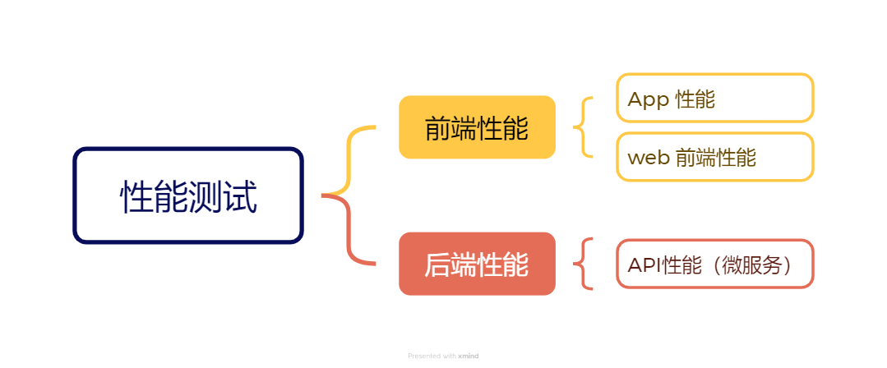
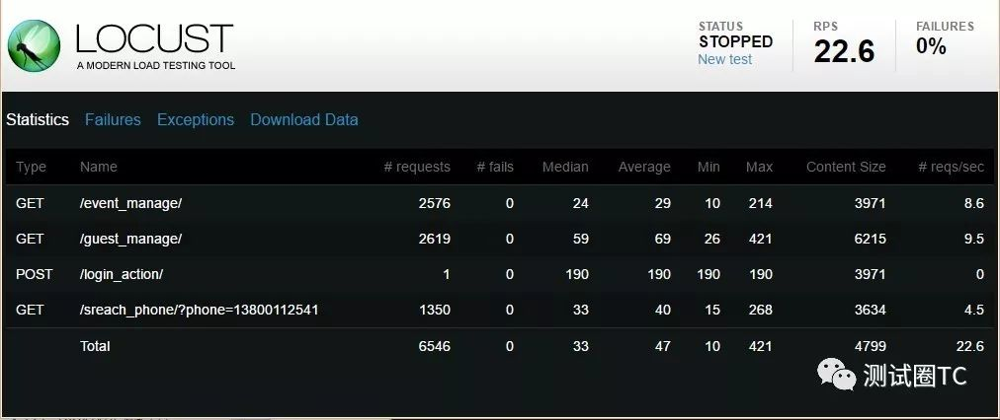
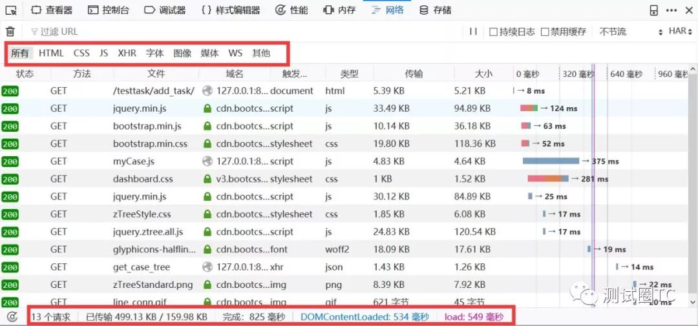
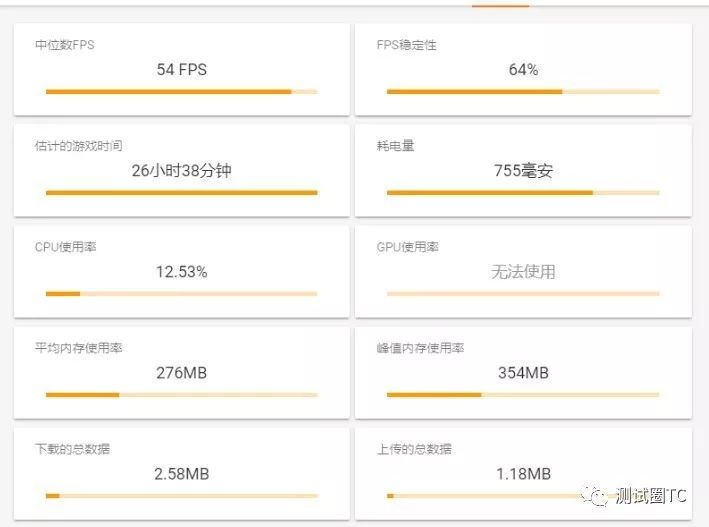
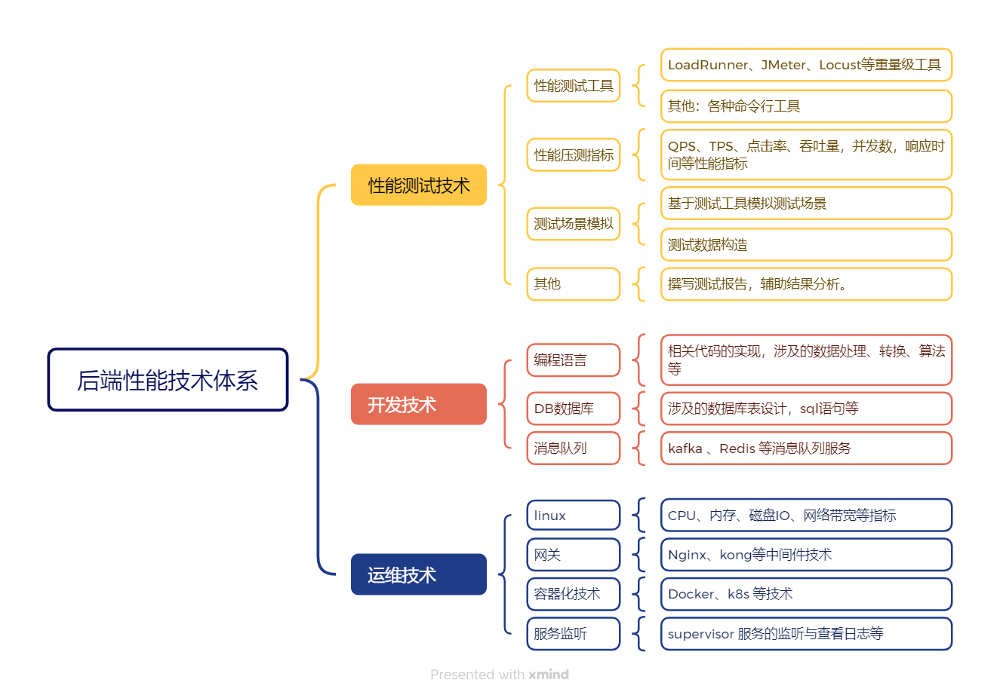
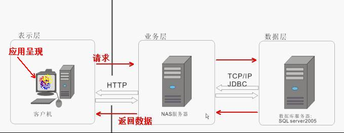

# learn-performance-class

## 基础篇幅

性能测试是一个很大的话题，在开始这个项目之前，我只是有个大体的框架，具体有哪些内容，一点点补充吧。

### 性能测试的分类

__最简单的分类__




__后端性能__

在微服务架构下， 后端性能其实就是接口性能。我们更多的时候不再设计模拟用户场景，而是针对单个或一组关联接口进行性能测试，这其实一定程度降低了测试的难度。



__Web 前端性能__

前端的运行有两种模式：

* 打包成静态资源文件，通过Nginx配置静态资源目录，直接访问。

/dist/index.html
/dist/static/js/app.js
/dist/static/css/app.css

Nginx 配置 /dist/ 8089、/8801

* 前端启动服务，动态运行。

node.js > npm run serve  --> 8088



前端的服务非常复杂，一些数据类的，一般通过调用后端端口返回数据，剩下的`css`、`javascript`、`图片`、`音视频`等资源一般会通过单独的CDN服务器获取，最后就是自身的HTML文件了。

__App 性能__

app性能主要考察的是手机本身的性能，包括cpu、内存、存储等。当然，一般app会涉及到与服务端数据的交互，同样会涉及到后端性能。




### 性能测试的目的

我们的系统就像由很多片木片组成的一个木桶。


性能测试的目的一般有两个:

1. 验证木桶里面最多能装多少水。
2. 找到最短的木片，并试图将最短的木片加长。

### 性能测试类型（后端）

经常会听别人说到`性能测试`、`负载测试`、`压力测试`、`并发测试`，`基准测试`等。这些概念除了非专业人员分不清楚，甚至许多专业测试人员也对这些名词的理解也很模糊，甚至经常混用。

__性能测试 (Performance Testing)__

性能测试的概念最早源自计算机系统的开发，它的主要目标是评估软件在特定工作负载下的表现。

是一个广义的概念，涵盖所有与系统性能相关的测试，包括响应时间、吞吐量、并发处理等。

* 目标：

在一定负载下，观察系统的性能表现，以确定是否满足生产要求。

* 关注点：

通常包括响应时间、吞吐量、资源利用率（如 CPU、内存、磁盘 I/O 等），数据传输速率、并发用户数、事务处理能力等性能指标是否符合要求。

* 应用场景：

通常用于了解系统在高负载场景下的性能，确定系统在特定用户数或请求量下的性能表现。适用于各种场景的性能评估。

* 示例：

在性能测试中，测试人员可能会检查一个电商网站在有1000名用户同时在线浏览时的页面加载速度是否在 2 秒以内。


__负载测试 (Load Testing)__

负载测试是性能测试的一种特定类型，它通常与大型服务器、数据库和网络相关，旨在模拟实际使用场景。

专注于在正常和高负载下的性能表现，通过逐步增加用户数或事务数，观察系统的响应。

* 目标：

验证系统在不同的负载（例如并发用户数或事务数）下的表现，测试系统能否在预期的负载范围内正常运行。

* 关注点：

系统在逐步增加负载时，性能是否保持稳定，以及在某一负载下性能是否开始下降。

* 应用场景：

这种方法目的是了解系统在高负载场景下的性能，确定系统在特定用户数或请求量下的表现。


* 示例：

测试一个系统在同时有 500、1000 和 5000 名用户访问时，系统的响应时间、吞吐量、错误率等指标如何变化。


__压力测试 (Stress Testing)__

压力测试源于硬件测试，用于测试系统在极限条件下的稳定性，后来被引入到软件测试中。

压力测试用于测试系统在超出设计负载的情况下的表现，目的是确定系统的崩溃点。


* 目标：

是检测系统的极限性能，找到系统的最大承载能力和失效点，并确保在故障发生时系统能够正确恢复。

* 关注点：
系统在负载过大时的表现，是否会崩溃，崩溃后的恢复能力如何。

* 应用场景：

用于检测系统的极限性能，找到系统的最大承载能力和失效点，并确保在故障发生时系统能够正确恢复。

* 示例：

测试一个电商平台的支付系统，突然有 10 万用户同时发起支付请求，观察系统是否会崩溃及其崩溃后的恢复机制。

__并发测试 (Concurrency Testing)__

并发测试源于数据库和多线程编程，主要用于测试多个用户或线程同时操作共享资源时的系统表现

* 目标

并发测试模拟多个用户或进程在同一时间段内访问和操作同一系统或资源，测试系统的并发处理能力。

* 关注点

资源锁定、死锁、数据冲突等问题。

* 应用场景：

特别适用于需要处理高并发访问的系统，如银行交易系统、在线游戏服务器等。

* 示例

测试一个多人在线协作的编辑工具，多个用户同时编辑同一文档，查看是否会导致数据不一致或系统响应延迟。


__基准测试 (Benchmark Testing)__

基准测试属于性能测试的一种，用于评估和衡量软件的性能指标。我们可以在软件开发的某个阶段通过基准测试建立一个已知的性能水平，称为`基准线`。当系统的软硬件环境发生变化之后再进行一次基准测试以确定那些变化对性能的影响。这是基准测试最常见的用途。

* 目标

通过与行业标准或历史数据进行对比，衡量系统的性能，确定其在某种工作负载下的表现。更多的是`一种对比分析`。

* 关注点：

比较不同环境下的系统性能，例如在不同硬件配置、数据库或操作系统环境中的表现。

* 应用场景：

用于确定系统在标准条件下的性能表现，通常作为性能基线，便于在后续测试中作为一个参考标准，帮助判断系统是否达到了预期的性能目标。

* 示例：

测试某个数据库管理系统的查询速度，并与其他同类产品进行对比，或者在不同版本之间进行对比。

__总结__

我们在进行性能测试的时候往往是综合的，既要逐步增加并发用户数据 - `负载测试`，又要关注测试的系统指标 - `性能测试`，还要验证数据的最大并发能力 - `压力测试`，最后还要将测试结果作为基准线 - `基准测试`。

不过，我们开展性能测试工作前，一定要明确性能测试的目标，在一次性能测试中，加载太多的目标，往往会让测试工作变得过于复杂，从而也缺乏侧重点，最终得到的结果也不一定准确。

### 性能需求分析（后端）

1、客户方提出

客户方能提出明确的性能需求，说明对方很重视性能测试，这样的企业一般是金融、电信、银行、医疗器械等；他们一般对系统的性能要求非常高，对性能也非常了解。提出需求也比较明确。

> 有时候也会遇到客户提处不合理的需求，例如：只有2000人使用的OA系统，要求并发用户2000，结合使用场景分析，显然是不合理的。注册用户数 和并发用户数是两个概念。

2、根据历史数据分析

对于一些面向用户的独立产品，比较难定位市场的大小，可以先上线运营一段时间，通过运营可以搜集客户资料，比如，每月、每星期、每天的峰值业务量是多少。用户以什么样的速度在增长。用户对系统的哪些功能模块使用的最多，他们所占的比例等等。

收集到这些数据之后，我们就可评估系统的系统需求指标，以及接下来的扩容目标，从而进行性能测试。

3、需求分析与定位

这里根据前期的需求分析与定位，来分析确定系统性能指标。例如某省幼儿园管理系统。统计全省有多少家幼儿园，幼儿园的人数，系统的使用时间段等。经过与需求人员交流分析也能得到比较明确的性能指标。

4、参考历史项目或其它同行业的项目

如果公司之前有类似的项目经验，根据项目大小及上次性能测试的一些指标。从根据项目的规模可以制定出相应的性能指标。

即使本公司没有类似的项目，但其它公司有类似的项目，例如，电商系统，可以找竞品，同等规模，或大于自己的产品，进行借鉴分析。——虽然不能完全照搬数据，但是可以通过其他行业成熟的需求来了解需要测试的项目有哪些，应该考虑到的情况有哪些种。 


**性能需求描述遵循原则**

性能测试需求的描述需要遵循一些基本原则，以确保测试的准确性和有效性。您提到的准确性、一致性和特定性是非常重要的方面，但还可以进一步补充和完善。以下是对这些原则的更正和补充：

1. 明确性（Specificity）：
   - 性能测试需求应具体明确，避免模糊不清的表述。
   - 明确指出测试的目的、范围、预期结果和关键性能指标（KPIs）。

2. 准确性（Accuracy）：
   - 性能测试数据应准确无误，测试方法和工具的选择应确保结果的精确性。
   - 避免因测试环境、数据或配置不当而导致的误差。

3. 一致性（Consistency）：
   - 性能测试应在相同或相似的条件下进行，以确保结果的可比性。
   - 测试方法和标准应保持一致，避免在不同测试轮次中引入不必要的变量。

4. 可重复性（Reproducibility）：
   - 性能测试应能够重复进行，以便验证结果的稳定性和可靠性。
   - 测试环境和条件应详细记录，以便其他测试人员能够重现测试过程。

5. 可衡量性（Measurability）：
   - 性能测试需求应明确关键性能指标（如响应时间、吞吐量、资源利用率等）的衡量方法和标准。
   - 确保测试能够量化地评估系统的性能表现。

6. 相关性（Relevance）：
   - 性能测试需求应与用户的实际使用场景和业务需求紧密相关。
   - 测试应模拟用户在实际操作中可能遇到的各种情况，以评估系统的真实性能。

7. 可行性（Feasibility）：
   - 性能测试需求应在技术、资源和时间等方面具有可行性。
   - 避免提出过于复杂或难以实现的测试需求。

8. 文档化（Documentation）：
   - 性能测试需求应详细记录并归档，以便后续测试人员参考和遵循。
   - 文档应包括测试目的、范围、方法、预期结果、关键性能指标和测试环境等信息。


### 性能测试知识体系（后端）

性能测试所涉及到的技术是方方面面的，如同组成木桶的木片，我罗列了相关技术体系，如下图所示。



> 注：以上技术体系罗列的并不全面，跟每个公司项目技术栈有很大关系。

早期我在刚成为软件测试工程师的时候错误的以为：__会不会做性能测试，取决于会不会用性能测试工具。__ 现在再来看这个理解过于片面了。性能测试，其实工具并不那么重要。甚至在某些场景下，我们可以不使用工具，单纯手写一些脚本来进行压测。

那么，性能测试的真正难点在哪里呢，我认为有两点。

1. 性能测试的场景的分析与构造。

2. 性能测试所涉及的系统性能分析。

我们也很难做到每一项技术都很精通，并了如指掌。就算如此，真实的系统实现了N多的业务逻辑代码，由许多开发人员共同完成。因此，__对于大型项目__，没有人可以做到对程序的每个细节都了解，需要更多的相关人员参与是必不可少的。

作为软件测试工程师，我们首先需要掌握好 __性能测试技术__ ，其次，进一步学习 __开发技术__ 和 __运维技术__ 。


### 性能指标（后端）


#### 并发用户数
  
  * 简短的可以叫 `并发数`。
  * 性能的可以叫 `并发虚拟用户数`

性能测试就通过工具模拟多用户同时对系统进行操作，对系统形成处理压力，来验证系统的性能（不太标准的解释）。好多人也简单的把性能测试当成并发测试。其中，__多用户同时__ 是性能测试的基础。


__并发的理解__

从最基本的角度来看，并发（concurrency）指的是两个或多个同时独立进行的活动。在计算机系统中，并发则是指同一个系统中，多个独立活动同时进行，而非依次进行。这通常涉及到多任务操作系统通过任务切换，让同一台计算机同时运行多个应用软件，或者在服务器上配备多核处理器，实现“真并发”。

在性能测试的语境下，严格意义上的并发并不仅仅局限于利用多核CPU或多台电脑来模拟同一时间点的并发请求。虽然这是模拟并发的一种常见方式，但并发的本质更在于模拟多个用户或系统组件在同一时间段内对系统产生的负载。


__相关概念__

* 系统用户数： 一般来指系统的注册用户数。

* 在线人数：一般来指当前正在使用的用户数。


> 假设有一个网站，注册用户才能登录使用各种功能，如上传头像，阅读专家文章等。该系统有20万注册用户，这就是说有20万用户可以使用这个网站的所有功能，20万就是这个网站的“系统用户数”，网站有一个在线统计功能，从统计数据中可以看到，同时登录网站的人数的最高记录是2万，就是有2万人同时用浏览器打开着这个网站。2万就是“同时在线人数”
 

__求并发用户数公式__

在实际的性能测试工作中，测试人员一般比较关心的是业务并发用户数，也就是从业务的角度关注应该设置多少个并发数比较合理。

下面是一个典型的上班签到系统，早上8点上班，90%的员工会选择7点半到8点（30分钟）的时间段登录签到系统进行签到。公司员工为1000人，平均每个员工登录签到系统的时长为1分钟。可以用下面的方法计算。

　　　　C=900/30*1

- C （concurrency）表示平均并发用户数，那么对这个签到系统每分钟的并发用户数为30


#### 吞吐量

吞吐量指在一次性能测试过程中网络上传输的数据量的总和。对于交互式应用来说，吞吐量指标反映的是服务器承受的压力，在容量规划的测试中，吞吐量是一个重点关注的指标，因为它能够说明系统级别的负载能力。

在性能调优过程中，吞吐量指标也有重要的价值。如一个大型工厂，他们的生产效率与生产速度很快，一天生产10W吨的货物，结果工厂的运输能力不行，就两辆小型三轮车一天拉2吨的货物，比喻有些夸张，但我想说明的是这个运输能力是整个系统的瓶颈。

> 提示，用吞吐量来衡量一个系统的输出能力是极其不准确的，用个最简单的例子说明，一个水龙头开一天一夜，流出10吨水；10个水龙头开1秒钟，流出0.1吨水。当然是一个水龙头的吞吐量大。你能说1个水龙头的出水能力是10个水龙头的强？所以，我们要加单位时间，看谁1秒钟的出水量大。这就是吞吐率。

__吞吐量指标的作用：__

我们的性能测试中查看吞吐量对我们的测试有什么意义呢。

1. 用户协助设计性能测试场景，以及衡量性能测试场景是否达到了预期的设计目标：在设计性能测试场景时，吞吐量可被用户协助设计性能测试场景，根据估算的吞吐量数据，可以对应到测试场景的事务发生频率，事务发生次数等；另外，在测试完成后，根据实际的吞吐量可以衡量测试是否达到了预期的目标。

2. 用于协助分析性能瓶颈：吞吐量的限制是性能瓶颈的一种重要表现形式，因此，有针对性地对吞吐量设计测试，可以协助尽快定位到性能冰晶所在位置。


__相关概念__


* 吞吐率

单位时间内网络上传输的数据量，也可以指单位时间内处理客户请求数量。它是衡量网络性能的重要指标，通常情况下，吞吐率用 __"字节数/秒"__ 来衡量，当然，你可以用 __“请求数/秒”__ 和 __“页面数/秒”__ 来衡量。其实，不管是一个请求还是一个页面，它的本质都是在网络上传输的数据，那么来表示数据的单位就是字节数。

　　不过以不同的方式表达的吞吐量可以说明不同层次的问题。例如，以字节数/秒方式表示的吞吐量主要受网络基础设置、服务器架构、应用服务器制约；以请求数/秒方式表示的吞吐量主要受应用服务器和应用代码的制约。

　　但是从业务的角度看，吞吐率也可以用“业务数/小时或天”、“访问人数/小时或天”、“页面访问量/小时或天”来衡量。例如，在银行卡审批系统中，可以用“千件/小时”来衡量系统的业务处理能力。那么，从用户的角度，一个表单提交可以得到一次审批。又引出来一个概念-- **事务**。


* 事务 (Transaction)

　　事务是指用户某一步或几步操作的集合。我们要保证它有一个完整意义。比如用户对某一个页面的一次请求，用户对某系统的一次登录，电商用户对商品的一次确认支付过程。这些我们都可以看作一个事务。那么如何衡量服务器对事务的处理能力。又引出一个概念-- **TPS**

 

* TPS (Transaction Per Second) 

TPS：每秒钟系统能够处理事务或交易的数量，它是衡量系统处理能力的重要指标。

> TPS：更侧重于系统的整体事务处理能力，包括请求的接收、处理和响应全过程。
> 假设一个电商网站在一个小时内处理了3600笔订单:  3600笔 / 3600s = 1笔/s

* QPS (Query Per Second)

QPS：指服务器每秒能够响应的查询次数，主要针对查询操作的性能评估。

> QPS：更侧重于查询操作的效率，特别是对于数据库或搜索引擎这类以查询为主的系统。
> 假设一个搜索引擎在一分钟内处理了18000个搜索请求: 18000次/60s = 30次/s

* 点击率（Hit Per Second）

点击率指的是每秒钟用户向服务器提交的HTTP请求数。这里的 __"点击"__ 不是指鼠标的一次物理点击操作，而一次点击可能触发的多个HTTP请求。

> 点击率: 侧重于关注的是用户每秒向服务器提交的HTTP请求数。
> 一个社交媒体网站发布的热门内容，一小时有1万的点击访问： 10000 / 3600 = 2.7次/s


#### 响应时间

响应时间指的是从用户点击开始到页面完全加载完毕的时间。



__响应时间过程分析__

我们需要对这个过程进行分解，才能得到你真正想要的响应时间。我把整个过程分三个部分: **数据呈现时间**，**数据传输时间** 和 **系统处理时间**。

* 数据呈现时间

其实主要说的浏览器对接收到数据的一个处理展示的过程。几年前大家都在用IE，如果页面显示比较慢，我们肯定不会怪罪IE，只会怪罪电信运营商的网速或被访问的系统（其实，大多情况我们不会考虑是被访问系统的问题）。现在chrome来了，我们会发现同一台电脑同一个网站，通过chrome去访问，页面的呈现速度会比IE略快。这是各种评测及大众用户的整体感受。

当然，我说这个数据呈现时间总不能全怪罪与浏览器的身上吧！当然还和承载它的操作系统有关，以及电脑硬件（比如cpu 内存）。假如你有超快的浏览器，如果是一台配置很低的电脑也会影响数据的呈现时间。

* 数据传输时间

千万不要忽视数据传输时间。如果你要寄信给你一个远方的朋友，你想是什么影响你将信息传递给远方的朋友？不是你写信的过程（如果你写的信不像书一样厚的话），也不是你朋友读信的过程，而是送信的过程。

> 拿我们系统的数据传输过程来说，我们发送一个请求需要时间，系统处理完后返回给我们也需要时间。初学性能测试工具的同学喜欢拿工具去测试互联网上的一些系统，甚至不懂性能的同学认为可以用性能测试工具将互联网上的一些网站压崩溃。貌似这一招比任何黑客攻击厉害多去。
> 那么，我觉得这些同学应该补补网络知识了，你的带宽是多少？互联网是个网，就是算是相同的起点与终点，它有可能走的不同的路线。有没有考虑网络延迟？就算你的并发请求都能成功的发出，但到目的地的时候，已经不能叫并发了。

这也是为什么在做性能测试时，一般要强调要在局域网中进行。当然，随着云服务器的出现，这里要强调在云服务器上进行。此外，也有特殊的性能测试需要在互联网中时行，那么它们重点不是求用户的最大的并发量，而是，真实用户的性能体验。

* 系统处理时间

系统得到请求后对请求进行处理并将结果返回。那我进行性能测试主要就是验证系统的处理时间，因为前面的呈现时间和数据传输时间都我们不可控制的，用户使用的电脑及浏览器千差万别，用户的网络状况千差万别。我们唯一能控制的就是将系统的处理请求的时间缩到最短暂。


* 响应时间

听了上面的分析，貌似每个过程都挺“浪费”时间，那么我们如何只测试系统的处理时间呢？

实际上，性能测试的时间关注点是在 __系统的处理时间__ 上，这个时间是可控的，也是我们性能测试的重点。数据呈现时间主要由用户的个人电脑或移动设备决定，数据传输时间主要由用户的网络决定。

响应时间： 指的是客户发出请求到得到响应的整个过程的时间。在某些工具中，请求响应时间通常会被称为“TTLB”(Time to laster byte) ,意思是从发起一个请求开始，到客户端收到最后一个字节的响应所耗费的时间。

* 2/5/8原则


> 2/5/8原则 出处：

> 早期研究：2/5/8原则最早可以追溯到20世纪80年代英国一家媒体针对音乐媒体服务所做的调查。该调查显示，大部分用户认为2秒以内的响应时间是优质的服务，而到了8秒时，约有一半的用户表示不满意。这一结论为后来的2/5/8原则提供了初步的基础。

> 进一步验证：到了90年代，特别是1993年，美国一家媒体针对零售业（如亚马逊、eBay等电商服务）进行了另一项关于响应时间的调查。这次调查得出的结论是，1秒是较好的响应时间，0.1秒是最理想的响应时间（因为人在此时间内几乎无感知），4秒是业务可以接受的上限（因为客户流失率在此时间点后明显增加），而10秒则被认为是完全不可接受的响应时间。虽然这项调查的具体数值与2/5/8原则不完全一致，但它进一步强调了响应时间对于用户体验的重要性，并为2/5/8原则提供了更广泛的验证和支持。

> 行业共识：随着时间的推移，2/5/8原则在性能测试领域逐渐形成了共识。它成为了一个简单而有效的评估工具，帮助性能测试人员快速判断系统的响应时间是否满足用户期望。

2024年的今天，2/5/8原则已经不再适用，我们不可再抱着30年前的原则，用户对于响应时间的容忍度变得很低，尤其对于互联网产品，超过2秒钟就认为是很慢，从而放弃产品的使用。

## 工具篇

性能工具分为：性能测试工具 与 命令行工具。

* 性能测试工具提供的功能比较全面，一般包括各种参数的配置，测试策略的配置，脚本编写，压测执行 和 结果分析，还包括分布式等能力。例如，loadrunner、JMeter、locust等。

* 命令行工具比较简单：一般通过命令提供压测参数，在终端输出压测结果。例如：Apache AB（Apache Benchmark）、vegeta、go-stress-testing 等。


### Locust

#### 基础使用

##### 简介

官网：https://locust.io/

> An open source load testing tool.

一个开源性能测试工具。

> define user behaviour with python code, and swarm your system with millions of simultaneous users.

使用 Python 代码来定义用户行为。用它可以模拟百万计的并发用户访问你的系统。


##### 特点

* 用代码定义用户行为

无需笨重的用户界面或臃肿的XML。只需纯代码。

你可以将常规Python库导入到测试中，并且使用Locust的可插拔架构，它具有无限的可扩展性。与使用大多数其他工具不同，你的测试设计将永远不会受到GUI或特定于领域的语言的限制。

* 支持命令行和GUI两种模式

可以从命令行或使用基于web的UI运行locust测试。UI界面可以更友好的实时查看吞吐量、响应时间和错误，并/或导出以供以后分析。命令行模式更易于集成的 CI/CD 工具。

* 分布式且可扩展

Locust支持在多台机器上分布式运行负载测试，因此可用于模拟数百万的并发用户。

* 能够测试任何系统

虽然locust主要工作与网站/服务，它可以用来测试几乎任何系统或协议。只需为您想要测试的内容编写一个客户端，或者探索社区创建的一些客户端。

插件项目：https://github.com/SvenskaSpel/locust-plugins

* 经过验证且经过实战考验

Locust已被用于模拟数百万的并发用户。战地游戏（Battlefield）的网页应用Battlelog就使用了Locust进行负载测试，因此可以说Locust是真正经过实战考验的；）。

* 支持自定义

locust很小，非常灵活，我们打算保持这种方式。如果你想发送报告数据到你喜欢的数据库和绘图系统，包装调用一个REST API来处理你的系统的细节，或者运行一个完全自定义的负载模式，没有什么能阻止你！


相比较loadrunner和jmeter的优点：

Locust 完全基本 Python 编程语言，采用 Pure Python 描述测试脚本，并且 HTTP 请求完全基于 Requests 库。除了 HTTP/HTTPS 协议，Locust 也可以测试其它协议的系统，只需要采用Python调用对应的库进行请求描述即可。

LoadRunner 和 Jmeter 这类采用进程和线程的测试工具，都很难在单机上模拟出较高的并发压力。Locust 的并发机制摒弃了进程和线程，采用协程（gevent）的机制。协程避免了系统级资源调度，由此可以大幅提高单机的并发能力。


##### 安装

github: https://github.com/locustio/locust/

* pip安装

```shell
pip install locust
```

__安装依赖分析__

这里简单介绍 Locust 都基于了哪些库。通过对依赖库的了解，对于locust的实现原理也可以窥探一二。

> ConfigArgParse
> flask
> Flask-Cors
> Flask-Login
> gevent
> geventhttpclient
> msgpack
> psutil
> pywin32
> pyzmq
> requests
> Werkzeug

主要依赖库介绍：

* flask 是 Python 的一个 Web 开发框架。

* gevent 是在 Python 中实现协程的一个第三方库。协程，又称微线程（Coroutine）。使用gevent可以获得极高的并发性能。

* MessagePack是一种高效的二进制序列化格式。它允许您像JSON一样在多种语言之间交换数据。但是它更快，更小。这个包提供了用于读写MessagePack数据的CPython绑定。

* psutil（进程和系统实用程序）是一个跨平台库，用于检索Python中运行的进程和系统利用率（CPU、内存、磁盘、网络、传感器）的信息。它主要用于系统监视、分析和限制进程资源以及管理运行中的进程。

* pyzmq 简介ZMQ是一套嵌入式的网络链接库,是一个基于内存的消息队列,工作起来更像是一个并发式的框架。

* Requests 用来做 HTTP 接口测试。

##### 示例

编写简单的性能测试脚本，创建 baidufile.py 文件，通过 Python 编写性能测试脚本。

```py
from locust import HttpUser, task, between

class QuickstartUser(HttpUser):
    wait_time = between(0.1, 0.2)

    @task
    def hello_world(self):
        self.client.get("/")
```

运行命令：

```
locust    # 脚本默认命名为 locustfile

或

locust -f baidufile.py  # 指定脚本的名称
```

浏览器打开：http://127.0.0.1:8089


输入用户并发数，启动时间，基础URL，运行时间（可选项），然后点击开始。

查看运行过程


#### 脚本编写

##### 编写一个locust脚本

locust 脚本默认命名为 `locustfile.py`， 

```python
import time
from locust import HttpUser, task, between


class QuickstartUser(HttpUser):
    wait_time = between(1, 5)

    @task
    def hello_world(self):
        self.client.get("/hello")
        self.client.get("/world")

    @task(3)
    def view_items(self):
        for item_id in range(10):
            self.client.get(f"/item?id={item_id}", name="/item")
            time.sleep(1)

    def on_start(self):
        self.client.post("/login", json={"username": "foo", "password": "bar"})
```

* `QuickstartUser` 类继承`HttpUser`类，用于模拟将要测试的用户。

> HttpUser类为每个用户提供了一个名为client的属性，该属性是一个HttpSession实例，可用于向我们想要加载测试的目标系统发送HTTP请求。当测试开始时，locust会为它模拟的每个用户创建一个该类的实例，并且每个用户都将在自己的绿色gevent线程中开始运行。
> 一个文件要成为有效的`locustfile`文件，必须至少包含一个从`User`继承的类。


* `wait_time` 每个任务执行之后的等待时间的，这里动态 1 ~ 2 秒之间。

* `@task`定义任务。
```py
    @task
    def hello_world(self):
        self.client.get("/hello")
        self.client.get("/world")
```

带有`@task`装饰器的方法是的locust文件的核心。对于每个运行的用户（User），Locust会为其创建一个绿色线程（`协程`或`微线程`），该线程将调用这些方法。

> 任务中的代码是按顺序执行的（它只是普通的Python代码），因此，只有在收到/hello响应后才会调用/world。


* 虚拟用户数分配

```py
    @task
    def hello_world(self):
        ...

    @task(3)
    def view_items(self):
        ...
```

我们通过用`@task`装饰两个方法来声明两个任务，其中一个被赋予了更高的权重(3)。当我们的`QuickstartUser`运行时，它将选择一个声明的任务-在本例中是`hello_world`或`view_items` -并执行它。任务是随机挑选的，但你可以给它们不同的权重。上述配置将使Locust选择`view_items`的可能性是选择`hello_world`的三倍。当任务完成执行后，User将在指定的等待时间内休眠（在本例中为1到5秒）。然后它会选择一个新的任务。

> 注意，只有用`@task`装饰的方法才会被选中，因此您可以按照自己喜欢的方式定义自己的内部助手方法。

* HTTP请求

```py

self.client.get("/hello")
self.client.post("/login", json={"username":"foo", "password":"bar"})
```

`self.client` 属性使得可以进行 HTTP 请求，这些请求将被 Locust 记录下来。有关如何进行其他类型的请求、验证响应等信息，

> 注意：HttpUser不是一个真正的浏览器，因此不会解析HTML响应来加载资源或呈现页面。但它会跟踪cookie。

* 请求分组

```py
  @task(3)
  def view_items(self):
    for item_id in range(10):
        self.client.get(f"/item?id={item_id}", name="/item")
        time.sleep(1)
```

在`view_items`任务中，我们通过使用可变查询参数加载10个不同的url。为了避免在Locust的统计数据中得到10个单独的条目——因为统计数据是按URL分组的——我们使用`name`参数将所有这些请求分组在一个名为`/item`的条目下。

* 前置方法

```py
  def on_start(self):
    ...
```

我们声明了一个`on_start()`方法。当每个模拟用户启动时，将调用具有此名称的方法。

此外，还有与之对应的 `ont_stop()` 方法， 当每个模拟用户启动时，将调用具有此名称的方法。

