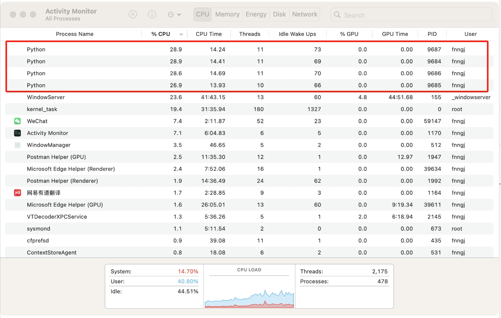

# learn-performance-class

## 基础篇幅

性能测试是一个很大的话题，在开始这个项目之前，我只是有个大体的框架，具体有哪些内容，一点点补充吧。

### 性能测试的分类

__最简单的分类__


__后端性能__

在微服务架构下， 后端性能其实就是接口性能。我们更多的时候不再设计模拟用户场景，而是针对单个或一组关联接口进行性能测试，这其实一定程度降低了测试的难度。


__Web 前端性能__

前端的运行有两种模式：

* 打包成静态资源文件，通过Nginx配置静态资源目录，直接访问。

/dist/index.html
/dist/static/js/app.js
/dist/static/css/app.css

Nginx 配置 /dist/ 8089、/8801

* 前端启动服务，动态运行。

node.js > npm run serve  --> 8088


前端的服务非常复杂，一些数据类的，一般通过调用后端端口返回数据，剩下的`css`、`javascript`、`图片`、`音视频`等资源一般会通过单独的CDN服务器获取，最后就是自身的HTML文件了。

__App 性能__

app性能主要考察的是手机本身的性能，包括cpu、内存、存储等。当然，一般app会涉及到与服务端数据的交互，同样会涉及到后端性能。


### 性能测试的目的

我们的系统就像由很多片木片组成的一个木桶。


性能测试的目的一般有两个:

1. 验证木桶里面最多能装多少水。
2. 找到最短的木片，并试图将最短的木片加长。

### 性能测试类型（后端）

经常会听别人说到`性能测试`、`负载测试`、`压力测试`、`并发测试`，`基准测试`等。这些概念除了非专业人员分不清楚，甚至许多专业测试人员也对这些名词的理解也很模糊，甚至经常混用。

__性能测试 (Performance Testing)__

性能测试的概念最早源自计算机系统的开发，它的主要目标是评估软件在特定工作负载下的表现。

是一个广义的概念，涵盖所有与系统性能相关的测试，包括响应时间、吞吐量、并发处理等。

* 目标：

在一定负载下，观察系统的性能表现，以确定是否满足生产要求。

* 关注点：

通常包括响应时间、吞吐量、资源利用率（如 CPU、内存、磁盘 I/O 等），数据传输速率、并发用户数、事务处理能力等性能指标是否符合要求。

* 应用场景：

通常用于了解系统在高负载场景下的性能，确定系统在特定用户数或请求量下的性能表现。适用于各种场景的性能评估。

* 示例：

在性能测试中，测试人员可能会检查一个电商网站在有1000名用户同时在线浏览时的页面加载速度是否在 2 秒以内。


__负载测试 (Load Testing)__

负载测试是性能测试的一种特定类型，它通常与大型服务器、数据库和网络相关，旨在模拟实际使用场景。

专注于在正常和高负载下的性能表现，通过逐步增加用户数或事务数，观察系统的响应。

* 目标：

验证系统在不同的负载（例如并发用户数或事务数）下的表现，测试系统能否在预期的负载范围内正常运行。

* 关注点：

系统在逐步增加负载时，性能是否保持稳定，以及在某一负载下性能是否开始下降。

* 应用场景：

这种方法目的是了解系统在高负载场景下的性能，确定系统在特定用户数或请求量下的表现。


* 示例：

测试一个系统在同时有 500、1000 和 5000 名用户访问时，系统的响应时间、吞吐量、错误率等指标如何变化。


__压力测试 (Stress Testing)__

压力测试源于硬件测试，用于测试系统在极限条件下的稳定性，后来被引入到软件测试中。

压力测试用于测试系统在超出设计负载的情况下的表现，目的是确定系统的崩溃点。


* 目标：

是检测系统的极限性能，找到系统的最大承载能力和失效点，并确保在故障发生时系统能够正确恢复。

* 关注点：
系统在负载过大时的表现，是否会崩溃，崩溃后的恢复能力如何。

* 应用场景：

用于检测系统的极限性能，找到系统的最大承载能力和失效点，并确保在故障发生时系统能够正确恢复。

* 示例：

测试一个电商平台的支付系统，突然有 10 万用户同时发起支付请求，观察系统是否会崩溃及其崩溃后的恢复机制。

__并发测试 (Concurrency Testing)__

并发测试源于数据库和多线程编程，主要用于测试多个用户或线程同时操作共享资源时的系统表现

* 目标

并发测试模拟多个用户或进程在同一时间段内访问和操作同一系统或资源，测试系统的并发处理能力。

* 关注点

资源锁定、死锁、数据冲突等问题。

* 应用场景：

特别适用于需要处理高并发访问的系统，如银行交易系统、在线游戏服务器等。

* 示例

测试一个多人在线协作的编辑工具，多个用户同时编辑同一文档，查看是否会导致数据不一致或系统响应延迟。


__基准测试 (Benchmark Testing)__

基准测试属于性能测试的一种，用于评估和衡量软件的性能指标。我们可以在软件开发的某个阶段通过基准测试建立一个已知的性能水平，称为`基准线`。当系统的软硬件环境发生变化之后再进行一次基准测试以确定那些变化对性能的影响。这是基准测试最常见的用途。

* 目标

通过与行业标准或历史数据进行对比，衡量系统的性能，确定其在某种工作负载下的表现。更多的是`一种对比分析`。

* 关注点：

比较不同环境下的系统性能，例如在不同硬件配置、数据库或操作系统环境中的表现。

* 应用场景：

用于确定系统在标准条件下的性能表现，通常作为性能基线，便于在后续测试中作为一个参考标准，帮助判断系统是否达到了预期的性能目标。

* 示例：

测试某个数据库管理系统的查询速度，并与其他同类产品进行对比，或者在不同版本之间进行对比。

__总结__

我们在进行性能测试的时候往往是综合的，既要逐步增加并发用户数据 - `负载测试`，又要关注测试的系统指标 - `性能测试`，还要验证数据的最大并发能力 - `压力测试`，最后还要将测试结果作为基准线 - `基准测试`。

不过，我们开展性能测试工作前，一定要明确性能测试的目标，在一次性能测试中，加载太多的目标，往往会让测试工作变得过于复杂，从而也缺乏侧重点，最终得到的结果也不一定准确。

### 性能需求分析（后端）

1、客户方提出

客户方能提出明确的性能需求，说明对方很重视性能测试，这样的企业一般是金融、电信、银行、医疗器械等；他们一般对系统的性能要求非常高，对性能也非常了解。提出需求也比较明确。

> 有时候也会遇到客户提处不合理的需求，例如：只有2000人使用的OA系统，要求并发用户2000，结合使用场景分析，显然是不合理的。注册用户数 和并发用户数是两个概念。

2、根据历史数据分析

对于一些面向用户的独立产品，比较难定位市场的大小，可以先上线运营一段时间，通过运营可以搜集客户资料，比如，每月、每星期、每天的峰值业务量是多少。用户以什么样的速度在增长。用户对系统的哪些功能模块使用的最多，他们所占的比例等等。

收集到这些数据之后，我们就可评估系统的系统需求指标，以及接下来的扩容目标，从而进行性能测试。

3、需求分析与定位

这里根据前期的需求分析与定位，来分析确定系统性能指标。例如某省幼儿园管理系统。统计全省有多少家幼儿园，幼儿园的人数，系统的使用时间段等。经过与需求人员交流分析也能得到比较明确的性能指标。

4、参考历史项目或其它同行业的项目

如果公司之前有类似的项目经验，根据项目大小及上次性能测试的一些指标。从根据项目的规模可以制定出相应的性能指标。

即使本公司没有类似的项目，但其它公司有类似的项目，例如，电商系统，可以找竞品，同等规模，或大于自己的产品，进行借鉴分析。——虽然不能完全照搬数据，但是可以通过其他行业成熟的需求来了解需要测试的项目有哪些，应该考虑到的情况有哪些种。 


**性能需求描述遵循原则**

性能测试需求的描述需要遵循一些基本原则，以确保测试的准确性和有效性。您提到的准确性、一致性和特定性是非常重要的方面，但还可以进一步补充和完善。以下是对这些原则的更正和补充：

1. 明确性（Specificity）：
   - 性能测试需求应具体明确，避免模糊不清的表述。
   - 明确指出测试的目的、范围、预期结果和关键性能指标（KPIs）。

2. 准确性（Accuracy）：
   - 性能测试数据应准确无误，测试方法和工具的选择应确保结果的精确性。
   - 避免因测试环境、数据或配置不当而导致的误差。

3. 一致性（Consistency）：
   - 性能测试应在相同或相似的条件下进行，以确保结果的可比性。
   - 测试方法和标准应保持一致，避免在不同测试轮次中引入不必要的变量。

4. 可重复性（Reproducibility）：
   - 性能测试应能够重复进行，以便验证结果的稳定性和可靠性。
   - 测试环境和条件应详细记录，以便其他测试人员能够重现测试过程。

5. 可衡量性（Measurability）：
   - 性能测试需求应明确关键性能指标（如响应时间、吞吐量、资源利用率等）的衡量方法和标准。
   - 确保测试能够量化地评估系统的性能表现。

6. 相关性（Relevance）：
   - 性能测试需求应与用户的实际使用场景和业务需求紧密相关。
   - 测试应模拟用户在实际操作中可能遇到的各种情况，以评估系统的真实性能。

7. 可行性（Feasibility）：
   - 性能测试需求应在技术、资源和时间等方面具有可行性。
   - 避免提出过于复杂或难以实现的测试需求。

8. 文档化（Documentation）：
   - 性能测试需求应详细记录并归档，以便后续测试人员参考和遵循。
   - 文档应包括测试目的、范围、方法、预期结果、关键性能指标和测试环境等信息。


### 性能测试知识体系（后端）

性能测试所涉及到的技术是方方面面的，如同组成木桶的木片，我罗列了相关技术体系，如下图所示。


> 注：以上技术体系罗列的并不全面，跟每个公司项目技术栈有很大关系。

早期我在刚成为软件测试工程师的时候错误的以为：__会不会做性能测试，取决于会不会用性能测试工具。__ 现在再来看这个理解过于片面了。性能测试，其实工具并不那么重要。甚至在某些场景下，我们可以不使用工具，单纯手写一些脚本来进行压测。

那么，性能测试的真正难点在哪里呢，我认为有两点。

1. 性能测试的场景的分析与构造。

2. 性能测试所涉及的系统性能分析。

我们也很难做到每一项技术都很精通，并了如指掌。就算如此，真实的系统实现了N多的业务逻辑代码，由许多开发人员共同完成。因此，__对于大型项目__，没有人可以做到对程序的每个细节都了解，需要更多的相关人员参与是必不可少的。

作为软件测试工程师，我们首先需要掌握好 __性能测试技术__ ，其次，进一步学习 __开发技术__ 和 __运维技术__ 。


### 性能指标（后端）


#### 并发用户数
  
  * 简短的可以叫 `并发数`。
  * 性能的可以叫 `并发虚拟用户数`

性能测试就通过工具模拟多用户同时对系统进行操作，对系统形成处理压力，来验证系统的性能（不太标准的解释）。好多人也简单的把性能测试当成并发测试。其中，__多用户同时__ 是性能测试的基础。


__并发的理解__

从最基本的角度来看，并发（concurrency）指的是两个或多个同时独立进行的活动。在计算机系统中，并发则是指同一个系统中，多个独立活动同时进行，而非依次进行。这通常涉及到多任务操作系统通过任务切换，让同一台计算机同时运行多个应用软件，或者在服务器上配备多核处理器，实现“真并发”。

在性能测试的语境下，严格意义上的并发并不仅仅局限于利用多核CPU或多台电脑来模拟同一时间点的并发请求。虽然这是模拟并发的一种常见方式，但并发的本质更在于模拟多个用户或系统组件在同一时间段内对系统产生的负载。


__相关概念__

* 系统用户数： 一般来指系统的注册用户数。

* 在线人数：一般来指当前正在使用的用户数。


> 假设有一个网站，注册用户才能登录使用各种功能，如上传头像，阅读专家文章等。该系统有20万注册用户，这就是说有20万用户可以使用这个网站的所有功能，20万就是这个网站的“系统用户数”，网站有一个在线统计功能，从统计数据中可以看到，同时登录网站的人数的最高记录是2万，就是有2万人同时用浏览器打开着这个网站。2万就是“同时在线人数”
 

__求并发用户数公式__

在实际的性能测试工作中，测试人员一般比较关心的是业务并发用户数，也就是从业务的角度关注应该设置多少个并发数比较合理。

下面是一个典型的上班签到系统，早上8点上班，90%的员工会选择7点半到8点（30分钟）的时间段登录签到系统进行签到。公司员工为1000人，平均每个员工登录签到系统的时长为1分钟。可以用下面的方法计算。

　　　　C=900/30*1

- C （concurrency）表示平均并发用户数，那么对这个签到系统每分钟的并发用户数为30


#### 吞吐量

吞吐量指在一次性能测试过程中网络上传输的数据量的总和。对于交互式应用来说，吞吐量指标反映的是服务器承受的压力，在容量规划的测试中，吞吐量是一个重点关注的指标，因为它能够说明系统级别的负载能力。

在性能调优过程中，吞吐量指标也有重要的价值。如一个大型工厂，他们的生产效率与生产速度很快，一天生产10W吨的货物，结果工厂的运输能力不行，就两辆小型三轮车一天拉2吨的货物，比喻有些夸张，但我想说明的是这个运输能力是整个系统的瓶颈。

> 提示，用吞吐量来衡量一个系统的输出能力是极其不准确的，用个最简单的例子说明，一个水龙头开一天一夜，流出10吨水；10个水龙头开1秒钟，流出0.1吨水。当然是一个水龙头的吞吐量大。你能说1个水龙头的出水能力是10个水龙头的强？所以，我们要加单位时间，看谁1秒钟的出水量大。这就是吞吐率。

__吞吐量指标的作用：__

我们的性能测试中查看吞吐量对我们的测试有什么意义呢。

1. 用户协助设计性能测试场景，以及衡量性能测试场景是否达到了预期的设计目标：在设计性能测试场景时，吞吐量可被用户协助设计性能测试场景，根据估算的吞吐量数据，可以对应到测试场景的事务发生频率，事务发生次数等；另外，在测试完成后，根据实际的吞吐量可以衡量测试是否达到了预期的目标。

2. 用于协助分析性能瓶颈：吞吐量的限制是性能瓶颈的一种重要表现形式，因此，有针对性地对吞吐量设计测试，可以协助尽快定位到性能冰晶所在位置。


__相关概念__


* 吞吐率

单位时间内网络上传输的数据量，也可以指单位时间内处理客户请求数量。它是衡量网络性能的重要指标，通常情况下，吞吐率用 __"字节数/秒"__ 来衡量，当然，你可以用 __“请求数/秒”__ 和 __“页面数/秒”__ 来衡量。其实，不管是一个请求还是一个页面，它的本质都是在网络上传输的数据，那么来表示数据的单位就是字节数。

　　不过以不同的方式表达的吞吐量可以说明不同层次的问题。例如，以字节数/秒方式表示的吞吐量主要受网络基础设置、服务器架构、应用服务器制约；以请求数/秒方式表示的吞吐量主要受应用服务器和应用代码的制约。

　　但是从业务的角度看，吞吐率也可以用“业务数/小时或天”、“访问人数/小时或天”、“页面访问量/小时或天”来衡量。例如，在银行卡审批系统中，可以用“千件/小时”来衡量系统的业务处理能力。那么，从用户的角度，一个表单提交可以得到一次审批。又引出来一个概念-- **事务**。


* 事务 (Transaction)

　　事务是指用户某一步或几步操作的集合。我们要保证它有一个完整意义。比如用户对某一个页面的一次请求，用户对某系统的一次登录，电商用户对商品的一次确认支付过程。这些我们都可以看作一个事务。那么如何衡量服务器对事务的处理能力。又引出一个概念-- **TPS**

 

* TPS (Transaction Per Second) 

TPS：每秒钟系统能够处理事务或交易的数量，它是衡量系统处理能力的重要指标。

> TPS：更侧重于系统的整体事务处理能力，包括请求的接收、处理和响应全过程。
> 假设一个电商网站在一个小时内处理了3600笔订单:  3600笔 / 3600s = 1笔/s

* QPS (Query Per Second)

QPS：指服务器每秒能够响应的查询次数，主要针对查询操作的性能评估。

> QPS：更侧重于查询操作的效率，特别是对于数据库或搜索引擎这类以查询为主的系统。
> 假设一个搜索引擎在一分钟内处理了18000个搜索请求: 18000次/60s = 30次/s

* 点击率（Hit Per Second）

点击率指的是每秒钟用户向服务器提交的HTTP请求数。这里的 __"点击"__ 不是指鼠标的一次物理点击操作，而一次点击可能触发的多个HTTP请求。

> 点击率: 侧重于关注的是用户每秒向服务器提交的HTTP请求数。
> 一个社交媒体网站发布的热门内容，一小时有1万的点击访问： 10000 / 3600 = 2.7次/s


#### 响应时间

响应时间指的是从用户点击开始到页面完全加载完毕的时间。


__响应时间过程分析__

我们需要对这个过程进行分解，才能得到你真正想要的响应时间。我把整个过程分三个部分: **数据呈现时间**，**数据传输时间** 和 **系统处理时间**。

* 数据呈现时间

其实主要说的浏览器对接收到数据的一个处理展示的过程。几年前大家都在用IE，如果页面显示比较慢，我们肯定不会怪罪IE，只会怪罪电信运营商的网速或被访问的系统（其实，大多情况我们不会考虑是被访问系统的问题）。现在chrome来了，我们会发现同一台电脑同一个网站，通过chrome去访问，页面的呈现速度会比IE略快。这是各种评测及大众用户的整体感受。

当然，我说这个数据呈现时间总不能全怪罪与浏览器的身上吧！当然还和承载它的操作系统有关，以及电脑硬件（比如cpu 内存）。假如你有超快的浏览器，如果是一台配置很低的电脑也会影响数据的呈现时间。

* 数据传输时间

千万不要忽视数据传输时间。如果你要寄信给你一个远方的朋友，你想是什么影响你将信息传递给远方的朋友？不是你写信的过程（如果你写的信不像书一样厚的话），也不是你朋友读信的过程，而是送信的过程。

> 拿我们系统的数据传输过程来说，我们发送一个请求需要时间，系统处理完后返回给我们也需要时间。初学性能测试工具的同学喜欢拿工具去测试互联网上的一些系统，甚至不懂性能的同学认为可以用性能测试工具将互联网上的一些网站压崩溃。貌似这一招比任何黑客攻击厉害多去。
> 那么，我觉得这些同学应该补补网络知识了，你的带宽是多少？互联网是个网，就是算是相同的起点与终点，它有可能走的不同的路线。有没有考虑网络延迟？就算你的并发请求都能成功的发出，但到目的地的时候，已经不能叫并发了。

这也是为什么在做性能测试时，一般要强调要在局域网中进行。当然，随着云服务器的出现，这里要强调在云服务器上进行。此外，也有特殊的性能测试需要在互联网中时行，那么它们重点不是求用户的最大的并发量，而是，真实用户的性能体验。

* 系统处理时间

系统得到请求后对请求进行处理并将结果返回。那我进行性能测试主要就是验证系统的处理时间，因为前面的呈现时间和数据传输时间都我们不可控制的，用户使用的电脑及浏览器千差万别，用户的网络状况千差万别。我们唯一能控制的就是将系统的处理请求的时间缩到最短暂。


* 响应时间

听了上面的分析，貌似每个过程都挺“浪费”时间，那么我们如何只测试系统的处理时间呢？

实际上，性能测试的时间关注点是在 __系统的处理时间__ 上，这个时间是可控的，也是我们性能测试的重点。数据呈现时间主要由用户的个人电脑或移动设备决定，数据传输时间主要由用户的网络决定。

响应时间： 指的是客户发出请求到得到响应的整个过程的时间。在某些工具中，请求响应时间通常会被称为“TTLB”(Time to laster byte) ,意思是从发起一个请求开始，到客户端收到最后一个字节的响应所耗费的时间。

* 2/5/8原则


> 2/5/8原则 出处：

> 早期研究：2/5/8原则最早可以追溯到20世纪80年代英国一家媒体针对音乐媒体服务所做的调查。该调查显示，大部分用户认为2秒以内的响应时间是优质的服务，而到了8秒时，约有一半的用户表示不满意。这一结论为后来的2/5/8原则提供了初步的基础。

> 进一步验证：到了90年代，特别是1993年，美国一家媒体针对零售业（如亚马逊、eBay等电商服务）进行了另一项关于响应时间的调查。这次调查得出的结论是，1秒是较好的响应时间，0.1秒是最理想的响应时间（因为人在此时间内几乎无感知），4秒是业务可以接受的上限（因为客户流失率在此时间点后明显增加），而10秒则被认为是完全不可接受的响应时间。虽然这项调查的具体数值与2/5/8原则不完全一致，但它进一步强调了响应时间对于用户体验的重要性，并为2/5/8原则提供了更广泛的验证和支持。

> 行业共识：随着时间的推移，2/5/8原则在性能测试领域逐渐形成了共识。它成为了一个简单而有效的评估工具，帮助性能测试人员快速判断系统的响应时间是否满足用户期望。

2024年的今天，2/5/8原则已经不再适用，我们不可再抱着30年前的原则，用户对于响应时间的容忍度变得很低，尤其对于互联网产品，超过2秒钟就认为是很慢，从而放弃产品的使用。

## 工具篇

性能工具分为：性能测试工具 与 命令行工具。

* 性能测试工具提供的功能比较全面，一般包括各种参数的配置，测试策略的配置，脚本编写，压测执行 和 结果分析，还包括分布式等能力。例如，loadrunner、JMeter、locust等。

* 命令行工具比较简单：一般通过命令提供压测参数，在终端输出压测结果。例如：Apache AB（Apache Benchmark）、vegeta、go-stress-testing 等。


### Locust

#### 基础使用

##### 简介

官网：https://locust.io/

> An open source load testing tool.

一个开源性能测试工具。

> define user behaviour with python code, and swarm your system with millions of simultaneous users.

使用 Python 代码来定义用户行为。用它可以模拟百万计的并发用户访问你的系统。


##### 特点

* 用代码定义用户行为

无需笨重的用户界面或臃肿的XML。只需纯代码。

你可以将常规Python库导入到测试中，并且使用Locust的可插拔架构，它具有无限的可扩展性。与使用大多数其他工具不同，你的测试设计将永远不会受到GUI或特定于领域的语言的限制。

* 支持命令行和GUI两种模式

可以从命令行或使用基于web的UI运行locust测试。UI界面可以更友好的实时查看吞吐量、响应时间和错误，并/或导出以供以后分析。命令行模式更易于集成的 CI/CD 工具。

* 分布式且可扩展

Locust支持在多台机器上分布式运行负载测试，因此可用于模拟数百万的并发用户。

* 能够测试任何系统

虽然locust主要工作与网站/服务，它可以用来测试几乎任何系统或协议。只需为您想要测试的内容编写一个客户端，或者探索社区创建的一些客户端。

插件项目：https://github.com/SvenskaSpel/locust-plugins

* 经过验证且经过实战考验

Locust已被用于模拟数百万的并发用户。战地游戏（Battlefield）的网页应用Battlelog就使用了Locust进行负载测试，因此可以说Locust是真正经过实战考验的；）。

* 支持自定义

locust很小，非常灵活，我们打算保持这种方式。如果你想发送报告数据到你喜欢的数据库和绘图系统，包装调用一个REST API来处理你的系统的细节，或者运行一个完全自定义的负载模式，没有什么能阻止你！


相比较loadrunner和jmeter的优点：

Locust 完全基本 Python 编程语言，采用 Pure Python 描述测试脚本，并且 HTTP 请求完全基于 Requests 库。除了 HTTP/HTTPS 协议，Locust 也可以测试其它协议的系统，只需要采用Python调用对应的库进行请求描述即可。

LoadRunner 和 Jmeter 这类采用进程和线程的测试工具，都很难在单机上模拟出较高的并发压力。Locust 的并发机制摒弃了进程和线程，采用协程（gevent）的机制。协程避免了系统级资源调度，由此可以大幅提高单机的并发能力。


##### 安装

github: https://github.com/locustio/locust/

* pip安装

```shell
pip install locust
```

__安装依赖分析__

这里简单介绍 Locust 都基于了哪些库。通过对依赖库的了解，对于locust的实现原理也可以窥探一二。

> ConfigArgParse
> flask
> Flask-Cors
> Flask-Login
> gevent
> geventhttpclient
> msgpack
> psutil
> pywin32
> pyzmq
> requests
> Werkzeug

主要依赖库介绍：

* flask 是 Python 的一个 Web 开发框架。

* gevent 是在 Python 中实现协程的一个第三方库。协程，又称微线程（Coroutine）。使用gevent可以获得极高的并发性能。

* MessagePack是一种高效的二进制序列化格式。它允许您像JSON一样在多种语言之间交换数据。但是它更快，更小。这个包提供了用于读写MessagePack数据的CPython绑定。

* psutil（进程和系统实用程序）是一个跨平台库，用于检索Python中运行的进程和系统利用率（CPU、内存、磁盘、网络、传感器）的信息。它主要用于系统监视、分析和限制进程资源以及管理运行中的进程。

* pyzmq 简介ZMQ是一套嵌入式的网络链接库,是一个基于内存的消息队列,工作起来更像是一个并发式的框架。

* Requests 用来做 HTTP 接口测试。

##### 示例

编写简单的性能测试脚本，创建 baidufile.py 文件，通过 Python 编写性能测试脚本。

```py
from locust import HttpUser, task, between

class QuickstartUser(HttpUser):
    wait_time = between(0.1, 0.2)

    @task
    def hello_world(self):
        self.client.get("/")
```

运行命令：

```
locust    # 脚本默认命名为 locustfile

或

locust -f baidufile.py  # 指定脚本的名称
```

浏览器打开：http://127.0.0.1:8089


输入用户并发数，启动时间，基础URL，运行时间（可选项），然后点击开始。

查看运行过程


#### 脚本编写

##### 编写一个locust脚本

locust 脚本默认命名为 `locustfile.py`， 

```python
import time
from locust import HttpUser, task, between


class QuickstartUser(HttpUser):
    wait_time = between(1, 5)

    @task
    def hello_world(self):
        self.client.get("/hello")
        self.client.get("/world")

    @task(3)
    def view_items(self):
        for item_id in range(10):
            self.client.get(f"/item?id={item_id}", name="/item")
            time.sleep(1)

    def on_start(self):
        self.client.post("/login", json={"username": "foo", "password": "bar"})
```

* `QuickstartUser` 类继承`HttpUser`类，用于模拟将要测试的用户。

> HttpUser类为每个用户提供了一个名为client的属性，该属性是一个HttpSession实例，可用于向我们想要加载测试的目标系统发送HTTP请求。当测试开始时，locust会为它模拟的每个用户创建一个该类的实例，并且每个用户都将在自己的绿色gevent线程中开始运行。
> 一个文件要成为有效的`locustfile`文件，必须至少包含一个从`User`继承的类。


* `wait_time` 每个任务执行之后的等待时间的，这里动态 1 ~ 2 秒之间。

* `@task`定义任务。
```py
    @task
    def hello_world(self):
        self.client.get("/hello")
        self.client.get("/world")
```

带有`@task`装饰器的方法是的locust文件的核心。对于每个运行的用户（User），Locust会为其创建一个绿色线程（`协程`或`微线程`），该线程将调用这些方法。

> 任务中的代码是按顺序执行的（它只是普通的Python代码），因此，只有在收到/hello响应后才会调用/world。


* 虚拟用户数分配

```py
    @task
    def hello_world(self):
        ...

    @task(3)
    def view_items(self):
        ...
```

我们通过用`@task`装饰两个方法来声明两个任务，其中一个被赋予了更高的权重(3)。当我们的`QuickstartUser`运行时，它将选择一个声明的任务-在本例中是`hello_world`或`view_items` -并执行它。任务是随机挑选的，但你可以给它们不同的权重。上述配置将使Locust选择`view_items`的可能性是选择`hello_world`的三倍。当任务完成执行后，User将在指定的等待时间内休眠（在本例中为1到5秒）。然后它会选择一个新的任务。

> 注意，只有用`@task`装饰的方法才会被选中，因此您可以按照自己喜欢的方式定义自己的内部助手方法。

* HTTP请求

```py

self.client.get("/hello")
self.client.post("/login", json={"username":"foo", "password":"bar"})
```

`self.client` 属性使得可以进行 HTTP 请求，这些请求将被 Locust 记录下来。有关如何进行其他类型的请求、验证响应等信息，

> 注意：HttpUser不是一个真正的浏览器，因此不会解析HTML响应来加载资源或呈现页面。但它会跟踪cookie。

* 请求分组

```py
  @task(3)
  def view_items(self):
    for item_id in range(10):
        self.client.get(f"/item?id={item_id}", name="/item")
        time.sleep(1)
```

在`view_items`任务中，我们通过使用可变查询参数加载10个不同的url。为了避免在Locust的统计数据中得到10个单独的条目——因为统计数据是按URL分组的——我们使用`name`参数将所有这些请求分组在一个名为`/item`的条目下。

* 前置方法

```py
  def on_start(self):
    ...
```

我们声明了一个`on_start()`方法。当每个模拟用户启动时，将调用具有此名称的方法。

此外，还有与之对应的 `ont_stop()` 方法， 当每个模拟用户启动时，将调用具有此名称的方法。

##### User 类

`User`类代表系统的一种类型的用户/场景。在进行测试运行时，指定要模拟的并发用户数量，然后Locust将为每个用户创建一个实例。你可以给这些类/实例添加任何你喜欢的属性，但有一些对蝗虫有特殊意义：

__wait_time 属性__

`wait_time`方法很容易在每个任务执行之后引入延迟。如果没有指定wait_time，则下一个任务将在一个任务完成后立即执行。

```py
from locust import User, task, between

class MyUser(User):
    @task
    def my_task(self):
        print("executing my_task")

     # 每次任务之间等待固定的 3 秒
    wait_time = constant(1)
    # 每次任务之间等待 0.5 到 10 秒之间的随机时间
    wait_time = between(0.5, 10)
    # 每秒最多执行 5 次任务
    wait_time = constant_throughput(5)
    # 每个任务之间至少间隔 2 秒
    wait_time = constant_pacing(2)
```

* `constant`： 使每次任务之间都有一个 固定的时间间隔。
* `between`： 让每个任务之间的等待时间是一个 随机值，范围在指定的最小值和最大值之间。
* `constant_throughput`： 使任务的执行速率保持在 每秒最多 X 次任务。无论每个任务执行多久，Locust 会调整等待时间以维持这个执行速率。
* `constant_pacing`： 确保每个任务之间的 最小间隔时间 是固定的，即确保任务间的等待时间不小于设定的 X 秒。这是 `constant_throughput` 的逆操作。


__weight 和 fixed_count 属性__

如果文件中存在多个用户类，并且在命令行中没有指定用户类，Locust将为每个用户类生成相同数量的用户。你还可以通过将其作为命令行参数传递，从相同的locustfile中指定要使用哪些用户类：

```shell
locust -f locust_file.py WebUser MobileUser
```

如果你希望模拟的某种类型用户数量多于其他类型用户，可以在这些类上设置`weight`（权重）属性。以下代码将使Locust生成的WebUser数量是MobileUser的3倍：

```py
class WebUser(User):
    weight = 3
    ...

class MobileUser(User):
    weight = 1
    ...
```

`fixed_count` 参数在 Locust 中用于指定一个用户类应该生成的固定用户实例数量。

这个参数非常有用，当你需要确保某些特定类型的用户（例如管理员或特定测试场景中的用户）在测试期间始终以固定数量存在时。

在下面的示例中，只生成一个AdminUser实例，以便在独立于总用户数量的情况下，对请求数量进行更精确的控制，以完成一些特定工作。

```py
class AdminUser(User):
    wait_time = constant(600)
    fixed_count = 1

    @task
    def restart_app(self):
        ...

class WebUser(User):
    ...
```

__host 属性__

host属性是要测试的主机的URL前缀（例如https://google.com）。它会自动添加到请求中，因此你以执行self.client.get（"/"）等操作。

```py
from locust import User

class MyUser(User):
    host = "https://www.baidu.com"
```

##### HttpUser类

HttpUser是最常用的User。它添加了一个用于发出HTTP请求的客户端属性。

__client属性 / HttpSession__

client是HttpSession的一个实例。HttpSession是requests.Session的一个子类/封装，因此它的功能都有详细的文档记录，并且对于许多人来说应该是熟悉的。HttpSession主要增加的功能是将请求结果报告给Locust（成功/失败、响应时间、响应长度、名称）。

它包含了所有HTTP方法的方法：get、post、put、……

就像requests.Session一样，它在请求之间保留cookies，因此它可以很容易地用于登录网站。

发送一个POST请求，查看响应，并隐式地重用我们在第二个请求中获得的任何会话cookie

```python
response = self.client.post("/login", {"username":"testuser", "password":"secret"})
print("响应状态码:", response.status_code)
print("响应文本:", response.text)
response = self.client.get("/my-profile")
```

HttpSession会捕获Session抛出的任何requests.RequestException（由连接错误、超时或类似原因引起），而不是返回一个状态码设置为0和内容设置为None的虚拟Response对象。

__验证响应__

如果HTTP响应代码是OK（<400），则请求被认为是成功的，但通常对响应进行一些额外的验证是很有用的。

你可以通过使用catch_response参数、with语句和对response.failure()的调用来将请求标记为失败

```python
with self.client.get("/", catch_response=True) as response:
    if response.text != "Success":
        response.failure("得到了错误的响应")
    elif response.elapsed.total_seconds() > 0.5:
        response.failure("请求耗时过长")
```

你也可以将请求标记为成功，即使响应代码不好：

```python
with self.client.get("/does_not_exist/", catch_response=True) as response:
    if response.status_code == 404:
        response.success()
```

你甚至可以通过在with块外部抛出异常然后捕获它，或者抛出locust异常（如下面的示例所示并让Locust捕获它）来完全避免记录请求。

```python
from locust.exception import RescheduleTask
...
with self.client.get("/does_not_exist/", catch_response=True) as response:
    if response.status_code == 404:
        raise RescheduleTask()
```

__REST/JSON APIs__

FastHttpUser提供了一个现成的rest方法，但你也可以自己来做：

```python
from json import JSONDecodeError
...
with self.client.post("/", json={"foo": 42, "bar": None}, catch_response=True) as response:
    try:
        if response.json()["greeting"] != "hello":
            response.failure("在greeting中没有得到预期的值")
    except JSONDecodeError:
        response.failure("响应无法解码为JSON")
    except KeyError:
        response.failure("响应不包含预期的键'greeting'")
```

__请求分组__

对于网站来说，其页面的URL包含某种动态参数是很常见的。通常将这些URL在用户统计信息中组合在一起是有意义的。这可以通过向HttpSession的不同请求方法传递一个name参数来实现。

示例：

```python
# 这些请求的统计数据将被分组在：/blog/?id=[id]
for i in range(10):
    self.client.get("/blog?id=%i" % i, name="/blog?id=[id]")
```

当与包装Requests会话的库/SDK交互时，可能无法将参数传入请求函数，此时提供了另一种请求分组方式，即通过设置client.request_name属性。

```python
# 这些请求的统计数据将被分组在：/blog/?id=[id]
self.client.request_name="/blog?id=[id]"
for i in range(10):
    self.client.get("/blog?id=%i" % i)
self.client.request_name=None
```

如果你想用最少的样板代码链接多个分组，你可以使用client.rename_request()上下文管理器。

```python
@task
def multiple_groupings_example(self):
    # 这些请求的统计数据将被分组在：/blog/?id=[id]
    with self.client.rename_request("/blog?id=[id]"):
        for i in range(10):
            self.client.get("/blog?id=%i" % i)

    # 这些请求的统计数据将被分组在：/article/?id=[id]
    with self.client.rename_request("/article?id=[id]"):
        for i in range(10):
            self.client.get("/article?id=%i" % i)
```

使用catch_response并直接访问request_meta，你甚至可以根据响应中的某些内容来重命名请求。

```python
with self.client.get("/", catch_response=True) as resp:
    resp.request_meta["name"] = resp.json()["name"]
```

__HTTP代理设置__

为了提高性能，我们通过将requests.Session的`trust_env`属性设置为False来配置requests，使其不在环境中查找HTTP代理设置。如果你不想这样做，你可以手动将`locust_instance.client.trust_env`设置为True。

有关详细信息，请参阅requests的文档。
https://requests.readthedocs.io/en/latest/api/#requests.Session.trust_env


**连接重用**

默认情况下，连接会被HttpUser重用，甚至跨任务运行。要避免连接重用，你可以这样做：

```python
self.client.get("/", headers={"Connection": "close"})
self.client.get("/new_connection_here")
```

或者你可以关闭整个requests.Session对象（这也会删除cookies、关闭SSL会话等）。这有一些CPU开销（并且由于SSL重新协商等原因，下一个请求的响应时间会更长），所以除非你真的需要，否则不要使用它。

```python
self.client.get("/")
self.client.close()
self.client.get("/new_connection_here")
```

__连接池__

由于每个HttpUser都会创建一个新的HttpSession，因此每个用户实例都有自己的连接池。这与真实用户（浏览器）与Web服务器交互的方式相似。

如果你反而想共享连接，你可以使用一个池管理器。要做到这一点，请将pool_manager类属性设置为urllib3.PoolManager的一个实例。

```python
from locust import HttpUser
from urllib3 import PoolManager

class MyUser(HttpUser):
    # 这个类的所有实例都将被限制为最多10个并发连接。
    pool_manager = PoolManager(maxsize=10, block=True)
```

有关更多配置选项，请参阅urllib3的文档。
https://urllib3.readthedocs.io/en/stable/reference/urllib3.poolmanager.html

##### Tasks

当启动负载测试时，将为每个模拟用户创建一个User类的实例，并且它们将在自己的greenlet中开始运行。当这些用户运行时，他们选择要执行的任务，休息一会儿，然后选择一个新任务，以此类推。


__@task 装饰器__

为User添加任务的最简单方式是使用task装饰器。

```python
from locust import User, task, constant

class MyUser(User):
    wait_time = constant(1)

    @task
    def my_task(self):
        print("User instance (%r) executing my_task" % self)
```
@task 接受一个可选的weight参数，可以用来指定任务的执行比例。在以下示例中，task2被选中执行的可能性是task1的两倍：

```python
from locust import User, task, between

class MyUser(User):
    wait_time = between(5, 15)

    @task(3)
    def task1(self):
        pass

    @task(6)
    def task2(self):
        pass
```

__tasks 属性__

另一种定义User任务的方式是通过设置tasks属性。

tasks属性要么是一个Tasks列表，要么是一个<Task : int>字典，其中Task可以是Python可调用对象或TaskSet类。如果任务是普通的Python函数，它们将接收一个参数，即执行任务的User实例。

以下是一个作为普通Python函数声明的User任务的示例：

```python
from locust import User, constant

def my_task(user):
    pass

class MyUser(User):
    tasks = [my_task]
    wait_time = constant(1)
```
如果tasks属性被指定为一个列表，每次要执行任务时，将从tasks属性中随机选择。然而，如果tasks是一个字典——键是可调用对象，值是整数——要执行的任务将随机选择，但整数作为比例。所以，有一个像这样的任务：

```python
{my_task: 3, another_task: 1}
```
my_task被执行的可能性是another_task的3倍。

内部地，上述字典实际上会被展开成一个列表（并且tasks属性被更新），看起来像这样：

```python
[my_task, my_task, my_task, another_task]
```
然后使用Python的random.choice()从列表中挑选任务。

__@tag 装饰器__

通过使用@tag装饰器给任务打标签，你可以在使用--tags和--exclude-tags参数时挑剔地选择哪些任务在测试期间执行。考虑以下示例：

```python
from locust import User, constant, task, tag

class MyUser(User):
    wait_time = constant(1)

    @tag('tag1')
    @task
    def task1(self):
        pass

    @tag('tag1', 'tag2')
    @task
    def task2(self):
        pass

    @tag('tag3')
    @task
    def task3(self):
        pass

    @task
    def task4(self):
        pass
```
如果你用--tags tag1开始这个测试，那么在测试期间只有task1和task2会被执行。如果你用--tags tag2 tag3开始它，只有task2和task3会被执行。

--exclude-tags的行为完全相反。所以，如果你用--exclude-tags tag3开始测试，只有task1、task2和task4会被执行。排除总是胜过包含，所以如果一个任务有一个你已经包含的标签和一个你已经排除的标签，它将不会被执行。


##### Event 

如果你想在测试中运行一些设置代码，通常只需将其放在locustfile的模块级别就足够了，但有时你需要在运行的特定时间点做一些事情。为了满足这一需求，Locust提供了事件钩子。

__`test_start` 和 `test_stop`__

如果你需要在负载测试的开始或停止时运行一些代码，你应该使用test_start和test_stop事件。你可以在locustfile的模块级别设置这些事件的监听器：

```python
from locust import events

@events.test_start.add_listener
def on_test_start(environment, **kwargs):
    print("A new test is starting")

@events.test_stop.add_listener
def on_test_stop(environment, **kwargs):
    print("A new test is ending")
```

__init__

init事件在每个Locust进程的开始时触发。这在分布式模式下特别有用，每个工作进程（而不是每个用户）都需要有机会进行一些初始化。例如，假设你有一些全局状态，从这个进程生成的所有用户都需要：

```python
from locust import events
from locust.runners import MasterRunner

@events.init.add_listener
def on_locust_init(environment, **kwargs):
    if isinstance(environment.runner, MasterRunner):
        print("I'm on master node")
    else:
        print("I'm on a worker or standalone node")
```

__其他事件__

请参阅使用事件钩子扩展Locust以了解其他事件以及如何使用它们的更多示例。
https://docs.locust.io/en/stable/extending-locust.html#extending-locust


##### 织你测试代码

重要的是要记住，locustfile.py只是一个普通的Python模块，由Locust导入。从这个模块中，你可以像在任何Python程序中一样自由地导入其他Python代码。当前工作目录会自动添加到python的sys.path中，因此任何位于工作目录中的Python文件/模块/包都可以使用python import语句导入。

对于小型测试，将所有测试代码都保留在单个locustfile.py中应该可以正常工作，但对于更大的测试套件，你可能希望将代码分割到多个文件和目录中。

你如何组织测试源代码当然完全取决于你，但我们建议你遵循Python的最佳实践。这里是一个虚构的Locust项目的示例文件结构：

```shell
common/
  __init__.py
  auth.py
  config.py
locustfile.py
requirements.txt
```

具有多个locustfiles的项目也可以将它们保存在单独的子目录中：

```shell
common/
  __init__.py
  auth.py
  config.py
my_locustfiles/
  api.py
  website.py
requirements.txt
```

使用上述任何项目结构，你的locustfile都可以使用以下方式导入通用库：

```python
import common.auth
```

#### 命令行工具

Locust主要通过命令行参数配置。

* 查看帮助

```shell
locust --help
```

##### 参数说明

以下是Locust命令行选项的表格形式，包括每个选项的说明：

| 选项                                         | 说明                                                                                                                                                          |
| -------------------------------------------- | ------------------------------------------------------------------------------------------------------------------------------------------------------------- |
| `-h, --help`                                 | 显示帮助信息并退出                                                                                                                                            |
| `-f <filename>, --locustfile <filename>`     | 包含测试的Python文件或模块，例如`my_test.py`。接受多个逗号分隔的.py文件、包名/目录或远程locustfile的URL。默认为`locustfile`。                                 |
| `--config <filename>`                        | 读取额外配置的文件。                                                                                                                                          |
| `-H <base url>, --host <base url>`           | 要进行负载测试的主机，格式如下：https://www.example.com                                                                                                       |
| `-u <int>, --users <int>`                    | 同时运行的Locust用户的最大数量。主要与`--headless`或`--autostart`一起使用。可以在测试期间通过键盘输入w, W（生成1, 10个用户）和s, S（停止1, 10个用户）来更改。 |
| `-r <float>, --spawn-rate <float>`           | 用户生成速率（每秒用户数）。主要与`--headless`或`--autostart`一起使用。                                                                                       |
| `-t <time string>, --run-time <time string>` | 指定运行时间后停止，例如(300s, 20m, 3h, 1h30m等)。仅与`--headless`或`--autostart`一起使用。默认为永久运行。                                                   |
| `-l, --list`                                 | 显示可能的用户类列表并退出。                                                                                                                                  |
| `--config-users [CONFIG_USERS ...]`          | 用户配置，可以是JSON字符串或文件。可以提供参数列表或JSON配置数组。                                                                                            |

**Web UI选项：**
| 选项                                         | 说明                                                                                                         |
| -------------------------------------------- | ------------------------------------------------------------------------------------------------------------ |
| `--web-host <ip>`                            | 绑定Web界面的主机。默认为`*`（所有接口）。                                                                   |
| `--web-port <port number>, -P <port number>` | 运行Web主机的端口。                                                                                          |
| `--headless`                                 | 禁用Web界面，并立即开始测试。使用`-u`和`-t`控制用户数量和运行时间。                                          |
| `--autostart`                                | 立即开始测试（像`--headless`，但不禁用Web UI）。                                                             |
| `--autoquit <seconds>`                       | 在运行完成后的X秒后完全退出Locust。仅与`--autostart`一起使用。默认为保持Locust运行，直到你使用CTRL+C关闭它。 |
| `--web-login`                                | 使用登录页面保护Web界面。                                                                                    |
| `--tls-cert <filename>`                      | 用于HTTPS服务的TLS证书的可选路径。                                                                           |
| `--tls-key <filename>`                       | 用于HTTPS服务的TLS私钥的可选路径。                                                                           |
| `--class-picker`                             | 在Web界面中启用选择框，以从所有可用的用户类和形状类中选择。                                                  |

**Master选项：**
| 选项                               | 说明                                                                                 |
| ---------------------------------- | ------------------------------------------------------------------------------------ |
| `--master`                         | 作为主节点启动Locust，工作节点连接到它。                                             |
| `--master-bind-host <ip>`          | 主节点监听的IP地址。默认为*（所有可用接口）。                                        |
| `--master-bind-port <port number>` | 主节点监听的端口。默认为5557。                                                       |
| `--expect-workers <int>`           | 延迟开始测试，直到连接到这个数量的工作节点（仅与`--headless/--autostart`组合使用）。 |
| `--expect-workers-max-wait <int>`  | 主节点等待工作节点连接的时间，直到放弃。默认为永远等待。                             |
| `--enable-rebalancing`             | 如果在测试运行期间添加或移除新工作节点，则重新分配用户。实验性功能。                 |

**Worker选项：**
| 选项                          | 说明                                                                                                                                                        |
| ----------------------------- | ----------------------------------------------------------------------------------------------------------------------------------------------------------- |
| `--worker`                    | 设置Locust以分布式模式运行，此进程作为工作节点。可以与设置`--locustfile`为`-`结合使用，从主节点下载它。                                                     |
| `--processes <int>`           | Locust进程的分叉次数，以启用系统使用。与`--worker`标志结合使用，或让它自动设置`--worker`和`--master`标志的一体化解决方案。Windows系统上不可用。实验性功能。 |
| `--master-host <hostname>`    | 要连接的Locust主节点的主机名。默认为127.0.0.1。                                                                                                             |
| `--master-port <port number>` | 在主节点上连接的端口。默认为5557。                                                                                                                          |

**标签选项：**
| 选项                                         | 说明                                                         |
| -------------------------------------------- | ------------------------------------------------------------ |
| `-T [<tag> ...], --tags [<tag> ...]`         | 要在测试中包括的标签列表，只有这样的任务才会被执行。         |
| `-E [<tag> ...], --exclude-tags [<tag> ...]` | 要从测试中排除的标签列表，只有没有匹配标签的任务才会被执行。 |

**请求统计信息选项：**
| 选项                 | 说明                                                                                                                                               |
| -------------------- | -------------------------------------------------------------------------------------------------------------------------------------------------- |
| `--csv <filename>`   | 以CSV格式将请求统计信息存储在文件中。设置此选项将生成三个文件：`<filename>_stats.csv`, `<filename>_stats_history.csv`和`<filename>_failures.csv`。 |
| `--csv-full-history` | 将每个统计条目以CSV格式存储到`_stats_history.csv`文件中。必须同时指定`--csv`参数以启用此功能。                                                     |
| `--print-stats`      | 在UI运行期间启用定期打印请求统计信息。                                                                                                             |
| `--only-summary`     | 在`--headless`运行期间禁用定期打印请求统计信息。                                                                                                   |
| `--reset-stats`      | 生成完成后重置统计信息。在分布式模式运行时，需要在主节点和工作节点上都设置。                                                                       |
| `--html <filename>`  | 将HTML报告存储在指定的文件路径中。                                                                                                                 |
| `--json`             | 将最终统计信息以JSON格式打印到stdout。与`--headless`和`--skip-log`一起使用，仅输出json数据非常有用。                                               |

**日志记录选项：**
| 选项                             | 说明                                                                 |
| -------------------------------- | -------------------------------------------------------------------- |
| `--skip-log-setup`               | 禁用Locust的日志记录设置。相反，配置由Locust测试或Python默认值提供。 |
| `--loglevel <level>, -L <level>` | 选择DEBUG/INFO/WARNING/ERROR/CRITICAL之间的日志级别。默认为INFO。    |
| `--logfile <filename>`           | 日志文件的路径。如果未设置，日志将输出到stderr。                     |

**其他选项：**
| 选项                                   | 说明                                                                                                    |
| -------------------------------------- | ------------------------------------------------------------------------------------------------------- |
| `--show-task-ratio`                    | 打印用户类的任务执行比例表。如果某些类定义了非零fixed_count属性，请与非零`--user`选项一起使用。         |
| `--show-task-ratio-json`               | 打印用户类的任务执行比例的JSON数据。如果某些类定义了非零fixed_count属性，请与非零`--user`选项一起使用。 |
| `--version, -V`                        | 显示程序的版本号并退出。                                                                                |
| `--exit-code-on-error <int>`           | 设置当测试结果包含任何失败或错误时使用的进程退出代码。默认为1。                                         |
| `-s <number>, --stop-timeout <number>` | 等待模拟用户完成任何执行任务的秒数，然后退出。默认为立即终止。在分布式运行时，这只需要在主节点上指定。  |
| `--equal-weights`                      | 使用等量分布的任务权重，覆盖locustfile中指定的权重。                                                    |

**用户类：**
| 选项                      | 说明                                                                                                                                                          |
| ------------------------- | ------------------------------------------------------------------------------------------------------------------------------------------------------------- |
| `<UserClass1 UserClass2>` | 在命令行的末尾，你可以列出要使用的用户类（可用用户类可以通过`--list`列出）。也可以使用环境变量`LOCUST_USER_CLASSES`来指定用户类。默认是使用所有可用的用户类。 |

**示例：**
| 命令                                                                   | 说明                                                                                                      |
| ---------------------------------------------------------------------- | --------------------------------------------------------------------------------------------------------- |
| `locust -f my_test.py -H https://www.example.com`                      | 运行`my_test.py`测试脚本，测试目标为`https://www.example.com`。                                           |
| `locust --headless -u 100 -t 20m --processes 4 MyHttpUser AnotherUser` | 以无头模式运行测试，最多100个用户，运行时间20分钟，分叉4个进程，并指定`MyHttpUser`和`AnotherUser`用户类。 |

更多详细信息，包括如何通过文件或环境变量设置选项，请参见文档：[Locust Configuration](https://docs.locust.io/en/stable/configuration.html)。


##### 无界面模式

你可以通过使用`--headless`标志与`-u/--users`和`-r/--spawn-rate`一起运行Locust，而不需要Web界面：

```shell
locust -f locust_files/my_locust_file.py --headless -u 100 -r 5

[2021-07-24 10:41:10,947] .../INFO/locust.main: No run time limit set, use CTRL+C to interrupt.
[2021-07-24 10:41:10,947] .../INFO/locust.main: Starting Locust 2.32.2
[2021-07-24 10:41:10,949] .../INFO/locust.runners: Ramping to 100 users using a 5.00 spawn rate
Name              # reqs      # fails  |     Avg     Min     Max  Median  |   req/s failures/s
----------------------------------------------------------------------------------------------

GET /hello             1     0(0.00%)  |     115     115     115     115  |    0.00    0.00
GET /world             1     0(0.00%)  |     119     119     119     119  |    0.00    0.00
----------------------------------------------------------------------------------------------

Aggregated             2     0(0.00%)  |     117     115     119     117  |    0.00    0.00
```
即使在无头模式下，你也可以在测试运行时更改用户数量。按`w`增加1个用户，或按`W`增加10个用户。按`s`减少1个用户，或按`S`减少10个用户。

__为测试设置时间限制__

要指定测试的运行时间，请使用`-t/--run-time`：

```shell
locust --headless -u 100 --run-time 1h30m
locust --headless -u 100 --run-time 60 # default unit is seconds
```
Locust将在时间到达后关闭。时间从测试开始时计算（而不是从增加用户完成时开始）。

__允许任务在关闭时完成迭代__

默认情况下，Locust会立即停止你的任务（甚至不等待请求完成）。要给运行中的任务一些时间来完成它们的迭代，请使用`-s/--stop-timeout`：

```shell
locust --headless --run-time 1h30m --stop-timeout 10s
```

__控制Locust进程的退出代码__

默认情况下，如果有任何失败的样本，locust进程将给出1的退出代码（使用`--exit-code-on-error`来更改该行为）。

你还可以通过设置Environment实例的process_exit_code在你的测试脚本中手动控制退出代码。这在作为自动化/计划测试运行Locust时特别有用，例如作为CI管道的一部分。

以下是一个示例，如果满足以下任何条件，它将把退出代码设置为非零：

- 超过1%的请求失败
- 平均响应时间超过200毫秒
- 响应时间的95百分位数大于800毫秒

```python
import logging
from locust import events

@events.quitting.add_listener
def _(environment, **kw):
    if environment.stats.total.fail_ratio > 0.01:
        logging.error("Test failed due to failure ratio > 1%")
        environment.process_exit_code = 1
    elif environment.stats.total.avg_response_time > 200:
        logging.error("Test failed due to average response time ratio > 200 ms")
        environment.process_exit_code = 1
    elif environment.stats.total.get_response_time_percentile(0.95) > 800:
        logging.error("Test failed due to 95th percentile response time > 800 ms")
        environment.process_exit_code = 1
    else:
        environment.process_exit_code = 0
```
注意，这段代码可以放在`locustfile.py`或任何其他在`locustfile`中导入的文件中。


#### 分布式运行

单个进程运行Locust可以模拟相当高的吞吐量。对于简单的测试计划和小负载，它可以每秒发出超过一千个请求，如果使用FastHttpUser，可能会超过一万个请求。

但是，如果你的测试计划复杂，或者你想要施加更大的负载，你需要扩展到多个进程，甚至可能是多个机器。幸运的是，Locust开箱即用地支持分布式运行。

为此，你需要启动一个带有`--master`标志的Locust实例，以及一个或多个带有`--worker`标志的实例。主实例运行Locust的Web界面，并告诉工作节点何时生成/停止用户。工作实例运行你的用户并将统计信息发送回主节点。主实例本身不运行任何用户。

为了简化启动，你可以使用`--processes`标志。它将启动一个主进程和指定数量的工作进程。它也可以与`--worker`结合使用，这样它只会启动工作节点。此功能依赖于`fork()`，因此在Windows上无法使用。

> 注意
> 由于Python无法充分利用每个进程的多个核心（参见GIL），你需要为每个处理器核心运行一个工作实例，以便访问所有计算能力。

> 注意
> 每个工作节点可以运行的用户数量几乎没有限制。Locust/gevent可以每个进程运行数千甚至数万个用户，只要它们的总请求速率（RPS）不太高。

如果Locust接近耗尽CPU资源，它将记录一个警告。如果没有警告，但你仍然无法生成预期的负载，那么问题可能是请求速率不足。

__单机__

启动一个主节点和4个工作进程非常简单：

```shell
locust --processes 4
```
你甚至可以自动检测机器中的逻辑核心数量，并为每个核心启动一个工作节点：

```shell
locust --processes -1
```


__多台机器__

在一台机器上以主模式启动Locust：

```shell
locust -f .\baidufile.py --master

[2024-11-09 16:07:54,984] LAPTOP-29068220/INFO/locust.main: Starting Locust 2.32.1
Error resolving address: [Errno 11001] getaddrinfo failed
[2024-11-09 16:07:55,029] LAPTOP-29068220/INFO/locust.main: Starting web interface at http://localhost:8089 (accepting connections from all network interfaces)
[2024-11-09 16:09:40,059] LAPTOP-29068220/INFO/locust.runners: fnngjdeMacBook-Pro.local_b5522632a57d49f7b68e556150ed2fa6 (index 0) reported as ready. 1 workers connected.
[2024-11-09 16:09:40,059] LAPTOP-29068220/INFO/locust.runners: fnngjdeMacBook-Pro.local_16263ab894d34f0f8d7001fba8674ea9 (index 1) reported as ready. 2 workers connected.
[2024-11-09 16:09:40,060] LAPTOP-29068220/INFO/locust.runners: fnngjdeMacBook-Pro.local_e29d2512417f4a32a6c60e65eb9100af (index 2) reported as ready. 3 workers connected.
[2024-11-09 16:09:40,060] LAPTOP-29068220/INFO/locust.runners: fnngjdeMacBook-Pro.local_c29f185756594353aacd207b28e1b203 (index 3) reported as ready. 4 workers connected.
```

然后在每个工作机器上：

```shell
locust -f - --worker --master-host 192.168.0.5 --processes 4       

[2024-11-09 16:09:38,882] fnngjdeMacBook-Pro/INFO/locust.main: Starting Locust 2.32.2
```

`192.168.0.5` 是master主节点的IP地址。

> 注意
> `-f -`参数告诉Locust从主节点获取locustfile，而不是从其本地文件系统获取。此功能是在Locust 2.23.0中引入的。

运行性能测试，工作机的CPU占用。



通过查看CPU占用，基本与 `--processes 4` 的配置吻合。


__多台机器，使用locust-swarm__

当你对locustfile进行更改时，你需要重新启动所有Locust进程。locust-swarm为你自动化了这一过程。它还解决了工作节点到主节点的防火墙/网络访问问题，使用SSH隧道（如果主节点在你的工作站上而工作节点在某个数据中心运行，这通常是一个问题）。

* 安装命令

```shell
pip install locust-swarm
```

* 架构图

```
                         +--------------------------+
                         |      控制节点（Control） |
                         |      使用 locust-swarm    |
                         +-------------+------------+
                                       |
           +---------------------------+---------------------------+
           |                           |                           |
+----------v---------+     +-----------v---------+     +-----------v---------+
|     主节点（Master）|     |   从节点1（Worker） |     |   从节点2（Worker） |
| locust 主节点服务   |     | locust 从节点服务   |     | locust 从节点服务   |
+---------------------+     +---------------------+     +---------------------+
```

* 启动命令

```shell
swarm -f my_locustfile.py --loadgen-list  192.168.0.5,192.168.0.153  --users 50 --host https://www.baidu.com
```

有关更多详细信息，请参见locust-swarm。

https://github.com/SvenskaSpel/locust-swarm

> 1. swarm 需要能够从控制节点通过 SSH 无密码连接到主节点和从节点。
> 2. swarm 更建议用docker的方式管理。

__分布式负载生成选项__

* `--master-host <hostname or ip>`
可选地与`--worker`一起使用，以设置主节点的主机名/IP（默认为localhost）。

* `--master-port <port number>`
可选地与`--worker`一起使用，以设置主节点的端口号（默认为5557）。

* `--master-bind-host <ip>`
可选地与`--master`一起使用。确定主节点将绑定到哪个网络接口。默认为*（所有可用接口）。

* `--master-bind-port <port number>`
可选地与`--master`一起使用。确定主节点将监听哪些网络端口。默认为5557。

* `--expect-workers <number of workers>`
在以`--headless`启动主节点时使用。主节点将在X个工作节点连接后等待，然后才开始测试。

__提高Locust的性能__

如果你计划运行大规模负载测试，可能会对使用Locust附带的替代HTTP客户端感兴趣。你可以在这里阅读更多信息：使用更快的HTTP客户端提高性能。

