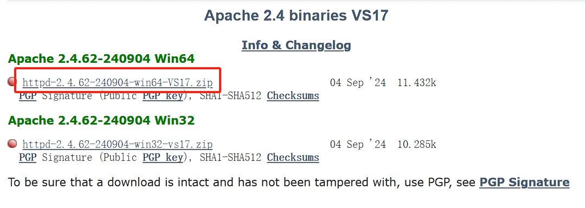
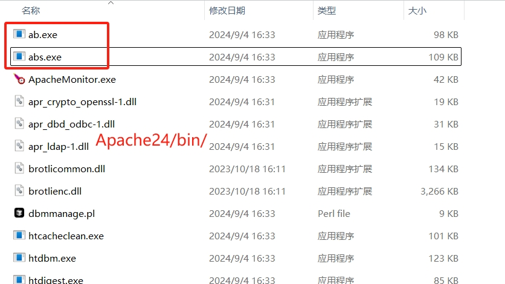
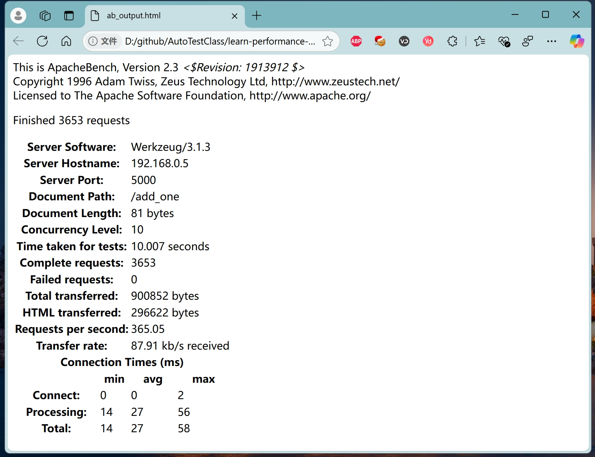
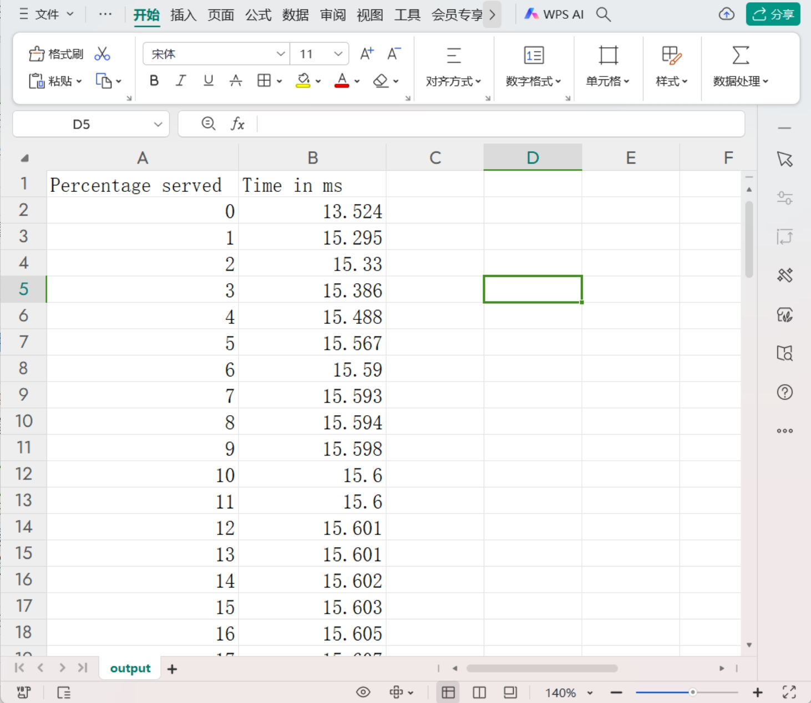
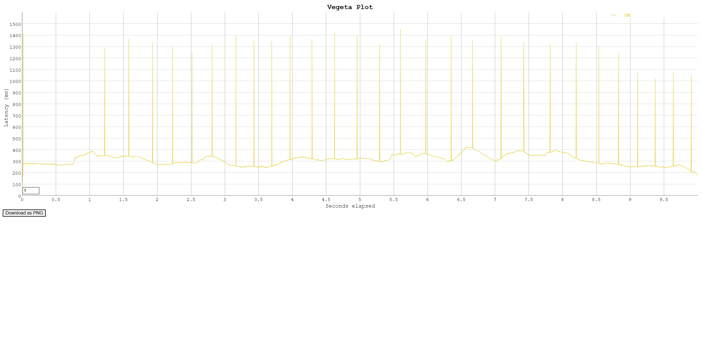

# 命令行性能工具

## Apache bench

### 介绍

Apache Bench原本是针对Apache HTTP服务器设计的，但同样适用于其他类型的HTTP服务器。该工具与标准Apache源码一起发布，是免费且开源的，基于Apache License。

> Apache Bench返回的最有用的信息是服务器每秒能够处理的请求次数（RPS），不过由于测试的页面不同，RPS会有所差异。通常，静态页面的RPS大于动态页面，页面体积越小，RPS越大。因此，RPS是相对的，在选择主机时，可以使用同一个页面进行测试，这样得到的数据相对来说更有可比性。

### 安装

__通过源码安装__

* 下载

下载地址：https://www.apachelounge.com/download/

选择当前最新的zip包进行下载：



* 解压

在解压的 `Apache24/bin/`目录下找到`ab`和`abs`可执行文件。




> ab.exe：这是Apache Bench（简称ab）的Windows可执行文件。ab主要用于测试HTTP服务器的性能，通过模拟多个并发请求来评估服务器在高并发环境下的负载能力和响应时间。它能够生成详细的测试报告，包括每秒请求数（Requests per second）、用户平均请求等待时间（Time per request）等关键性能指标。
> 
> abs.exe：abs是ab的增强版或特定版本，专门用于测试HTTPS服务器的性能。与ab.exe类似，abs.exe也能够模拟多个并发请求，并生成详细的测试报告。然而，它的主要区别在于支持HTTPS协议，因此更适合用于评估HTTPS服务器的性能和安全性。

* 配置环境变量

略


### 使用


**基本命令格式**：

```shell
ab [options] [http[s]://]hostname[:port]/path
```

其中，`[options]`代表各种可选参数，用于配置测试的具体细节；`[http[s]://]hostname[:port]/path`代表要测试的HTTP（或HTTPS）服务器的地址、端口和路径。


**参数说明**：

```shell
ab --help
```

`ab`（Apache Bench）命令的参数及其说明信息：

| 参数              | 说明                                                                                               |
| ----------------- | -------------------------------------------------------------------------------------------------- |
| `-n requests`     | 要执行的请求数                                                                                      |
| `-c concurrency`  | 一次要执行的多请求数（并发数）                                                                      |
| `-t timelimit`    | 测试所用的最大时间（秒），这隐含着`-n 50000`                                                        |
| `-s timeout`      | 等待每个响应的最大时间（秒），默认是30秒                                                            |
| `-b windowsize`   | TCP发送/接收缓冲区的大小（字节）                                                                    |
| `-B address`      | 在建立出站连接时要绑定的地址                                                                        |
| `-p postfile`     | 包含要POST的数据的文件，记得还要设置`-T`                                                            |
| `-u putfile`      | 包含要PUT的数据的文件，记得还要设置`-T`                                                             |
| `-T content-type` | 用于POST/PUT数据的Content-type头部，例如`'application/x-www-form-urlencoded'`，默认是`'text/plain'` |
| `-v verbosity`    | 打印多少故障排除信息                                                                                |
| `-w`              | 以HTML表格的形式打印结果                                                                            |
| `-i`              | 使用HEAD代替GET                                                                                     |
| `-x attributes`   | 作为表格属性插入的字符串                                                                            |
| `-y attributes`   | 作为tr属性插入的字符串                                                                              |
| `-z attributes`   | 作为td或th属性插入的字符串                                                                          |
| `-C attribute`    | 添加Cookie，例如`'Apache=1234'`（可重复）                                                           |
| `-H attribute`    | 添加任意头部行，例如`'Accept-Encoding: gzip'`，在所有正常头部行之后插入（可重复）                   |
| `-A attribute`    | 添加Basic WWW认证，属性是冒号分隔的用户名和密码                                                     |
| `-P attribute`    | 添加Basic代理认证，属性是冒号分隔的用户名和密码                                                     |
| `-X proxy:port`   | 要使用的代理服务器和端口号                                                                          |
| `-V`              | 打印版本号并退出                                                                                    |
| `-k`              | 使用HTTP KeepAlive功能                                                                              |
| `-d`              | 不显示服务百分比的表格                                                                              |
| `-S`              | 不显示置信估计和警告                                                                                |
| `-q`              | 当请求数超过150时，不显示进度                                                                       |
| `-l`              | 接受可变文档长度（用于动态页面）                                                                    |
| `-g filename`     | 将收集的数据输出到gnuplot格式的文件                                                                 |
| `-e filename`     | 输出包含服务百分比的CSV文件                                                                         |
| `-r`              | 在套接字接收错误时不退出                                                                            |
| `-m method`       | 方法名称                                                                                            |
| `-h`              | 显示使用信息（此消息）                                                                              |


**常用参数**

`-n`: 请求的总数。
`-c`: 每次并发用户数。
`-t`: 测试所用的最大时间。


**示例**

* 限制总请求数据为 1000，并发用户数为10。

```shell
ab -n 1000 -c 10 http://127.0.0.1:5000/add_one
```

* 限制请求时间为10s，并发用户数为10。

```shell
ab  -t 10s -c 10 http://127.0.0.1:5000/add_one
```

* GET请求带参数

```shell
ab -n 1 -c 1  http://127.0.0.1:5000//user/tom
ab -n 1 -c 1 http://127.0.0.1:5000/search/?q=selenium
```

* POST请求带参数，`x-www-from-urlencded`数据格式。

`post_data.txt`

```txt
username=admin&password=a123456
```

```shell
ab -c 1 -n 1 -p ./scripts/post_data.txt -T "application/x-www-form-urlencoded" http://127.0.0.1:5000/login
```

* POST请求带参数，`JSON`数据格式。

`post_json.txt`

```json
{"name": "jack", "age": 22, "height": 177}
```

```shell
ab -c 1 -n 1 -p ./scripts/post_json.txt -T "application/json" http://127.0.0.1:5000/add_user
```

* 生成HTML文件。

```shell
ab  -t 10s -c 10  -w  http://127.0.0.1:5000/add_one

<p>
 This is ApacheBench, Version 2.3 <i>&lt;$Revision: 1913912 $&gt;</i><br>
 Copyright 1996 Adam Twiss, Zeus Technology Ltd, http://www.zeustech.net/<br>
 Licensed to The Apache Software Foundation, http://www.apache.org/<br>
</p>
<p>
Completed 5000 requests
Finished 6234 requests


<table >
<tr ><th colspan=2 bgcolor=white>Server Software:</th><td colspan=2 bgcolor=white>Werkzeug/3.1.3</td></tr>
<tr ><th colspan=2 bgcolor=white>Server Hostname:</th><td colspan=2 bgcolor=white>127.0.0.1</td></tr>
<tr ><th colspan=2 bgcolor=white>Server Port:</th><td colspan=2 bgcolor=white>5000</td></tr>
<tr ><th colspan=2 bgcolor=white>Document Path:</th><td colspan=2 bgcolor=white>/add_one</td></tr>
<tr ><th colspan=2 bgcolor=white>Document Length:</th><td colspan=2 bgcolor=white>77 bytes</td></tr>
<tr ><th colspan=2 bgcolor=white>Concurrency Level:</th><td colspan=2 bgcolor=white>10</td></tr>
<tr ><th colspan=2 bgcolor=white>Time taken for tests:</th><td colspan=2 bgcolor=white>10.005 seconds</td></tr>
<tr ><th colspan=2 bgcolor=white>Complete requests:</th><td colspan=2 bgcolor=white>6234</td></tr>
<tr ><th colspan=2 bgcolor=white>Failed requests:</th><td colspan=2 bgcolor=white>6225</td></tr>
<tr ><td colspan=4 bgcolor=white >   (Connect: 0, Length: 6225, Exceptions: 0)</td></tr>
<tr ><th colspan=2 bgcolor=white>Total transferred:</th><td colspan=2 bgcolor=white>1528428 bytes</td></tr>
<tr ><th colspan=2 bgcolor=white>HTML transferred:</th><td colspan=2 bgcolor=white>498333 bytes</td></tr>
<tr ><th colspan=2 bgcolor=white>Requests per second:</th><td colspan=2 bgcolor=white>623.11</td></tr>
<tr ><th colspan=2 bgcolor=white>Transfer rate:</th><td colspan=2 bgcolor=white>149.19 kb/s received</td></tr>
<tr ><th bgcolor=white colspan=4>Connection Times (ms)</th></tr>
<tr ><th bgcolor=white>&nbsp;</th> <th bgcolor=white>min</th>   <th bgcolor=white>avg</th>   <th bgcolor=white>max</th></tr>
<tr ><th bgcolor=white>Connect:</th><td bgcolor=white>    0</td><td bgcolor=white>    0</td><td bgcolor=white>    1</td></tr>
<tr ><th bgcolor=white>Processing:</th><td bgcolor=white>   14</td><td bgcolor=white>   16</td><td bgcolor=white>   46</td></tr>
<tr ><th bgcolor=white>Total:</th><td bgcolor=white>   14</td><td bgcolor=white>   16</td><td bgcolor=white>   47</td></tr>
</table>
```
将结果从控制台拷贝到 `ab_output.html` 文件保存，并通过浏览器打开。



> 太丑了，我要不加哥浏览器边框，你都看不出来是HTML页面。

* 生成详细测试结果。

```shell
ab  -t 10s -c 10 -g output.txt  http://127.0.0.1:5000/add_one
```

`output.txt`文件内容:

```
starttime	seconds	ctime	dtime	ttime	wait
Fri Nov 29 19:01:56 2024	1732878116	0	13	13	3
Fri Nov 29 19:02:04 2024	1732878124	0	14	14	3
Fri Nov 29 19:02:03 2024	1732878123	0	14	14	3
Fri Nov 29 19:02:00 2024	1732878120	0	14	14	3
Fri Nov 29 19:01:56 2024	1732878116	0	14	14	3
...
```

* 生成CSV文件。

```shell
ab  -t 10s -c 10 -e output.csv  http://127.0.0.1:5000/add_one
```




**测试结果**


```shell
ab -n 100 -c 10 http://127.0.0.1:5000/add_one

This is ApacheBench, Version 2.3 <$Revision: 1913912 $>
Copyright 1996 Adam Twiss, Zeus Technology Ltd, http://www.zeustech.net/
Licensed to The Apache Software Foundation, http://www.apache.org/

Benchmarking 127.0.0.1 (be patient).....done


Server Software:        Werkzeug/3.1.3
Server Hostname:        127.0.0.1
Server Port:            5000

Document Path:          /add_one
Document Length:        57 bytes

Concurrency Level:      10
Time taken for tests:   22.250 seconds
Complete requests:      100
Failed requests:        0
Total transferred:      22200 bytes
HTML transferred:       5700 bytes
Requests per second:    4.49 [#/sec] (mean)
Time per request:       2225.002 [ms] (mean)
Time per request:       222.500 [ms] (mean, across all concurrent requests)
Transfer rate:          0.97 [Kbytes/sec] received

Connection Times (ms)
              min  mean[+/-sd] median   max
Connect:        0    0   0.4      0       1
Processing:  2013 2023   4.9   2024    2033
Waiting:     2001 2004   1.8   2004    2008
Total:       2013 2023   4.8   2024    2033

Percentage of the requests served within a certain time (ms)
  50%   2024
  66%   2025
  75%   2026
  80%   2027
  90%   2029
  95%   2033
  98%   2033
  99%   2033
 100%   2033 (longest request)
```

以下是对这些结果的解释：

以下是将上述内容使用Markdown表格重新生成的版本：

| 项目               | 描述                               | 值                          |
| ------------------ | ---------------------------------- | --------------------------- |
| **服务器信息**     |                                    |                             |
| 服务器软件         | Werkzeug版本                       | 3.1.3                       |
| 服务器主机名       | IP地址                             | 127.0.0.1                   |
| 服务器端口         | 监听的端口                         | 5000                        |
| 文档路径           | 请求的URL路径                      | /add_one                    |
| 文档长度           | 响应的文档长度                     | 57字节                      |
| **性能指标**       |                                    |                             |
| 并发级别           | 并发请求数                         | 10                          |
| 测试耗时           | 整个测试花费的时间                 | 22.250秒                    |
| 完成请求数         | 完成的请求总数                     | 100                         |
| 失败请求数         | 失败的请求数                       | 0                           |
| 总传输量           | 总共传输的数据量                   | 22200字节                   |
| HTML传输量         | 传输的HTML内容总量                 | 5700字节                    |
| 每秒请求数         | 平均每秒处理的请求数               | 4.49[#/sec]                 |
| 每个请求耗时       | 平均每个请求花费的时间             | 2225.002[ms]                |
| 传输速率           | 接收到的数据传输速率               | 0.97[Kbytes/sec]            |
| **连接时间**       |                                    |                             |
| 连接时间           | 最小值/平均值/标准差/中位数/最大值 | 0/0/0.4/0/1[ms]             |
| 处理时间           | 最小值/平均值/标准差/中位数/最大值 | 2013/2023/4.9/2024/2033[ms] |
| 等待时间           | 最小值/平均值/标准差/中位数/最大值 | 2001/2004/1.8/2004/2008[ms] |
| 总时间             | 最小值/平均值/标准差/中位数/最大值 | 2013/2023/4.8/2024/2033[ms] |
| **百分比响应时间** |                                    |                             |
| 50%请求耗时        |                                    | 2024[ms]                    |
| 66%请求耗时        |                                    | 2025[ms]                    |
| 75%请求耗时        |                                    | 2026[ms]                    |
| 80%请求耗时        |                                    | 2027[ms]                    |
| 90%请求耗时        |                                    | 2029[ms]                    |
| 95%请求耗时        |                                    | 2033[ms]                    |
| 98%请求耗时        |                                    | 2033[ms]                    |
| 99%请求耗时        |                                    | 2033[ms]                    |
| 最长请求耗时       |                                    | 2033[ms]                    |


__性能结果分析__

从结果来看，这个Flask应用的性能并不高，平均每秒只能处理4.49个请求，每个请求的平均处理时间是2225毫秒。这可能是因为Flask和Werkzeug是为了开发和测试而设计的，而不是为了高性能的生产环境。如果你需要处理大量的并发请求，你可能需要考虑使用更高效的WSGI服务器（如Gunicorn或uWSGI）和/或优化你的应用代码。


### 注意事项

1. 在进行压力测试时，应确保测试环境与实际生产环境尽可能一致，以获得更准确的结果。
2. 测试过程中可能会产生大量日志和错误信息，建议提前配置好日志存储路径和错误处理机制。
3. 根据测试需求调整并发数和请求数等参数，以获得不同压力下的服务器性能表现。


## Vegeta

### 介绍

项目地址：https://github.com/tsenart/vegeta

Vegeta（贝吉塔）是一个多功能的HTTP负载测试工具，它是基于对具有恒定请求率的HTTP服务进行钻取的需求而构建的， “It is cover 9000”

> “超过9000了！”，也简称为“超过9000!”，是2006年流行起来的一个网络梗，与1997年4月19日播出的《龙珠Z》动画电视连续剧《悟空归来》的一集的英语本地化有关。这个短语通常用作无数量词来描述大量的东西。这个短语的变体也被用作一种形式的trolling。
> 这个短语指的是赛亚人角色贝吉塔用日语说出的原始台词的变化，演员布莱恩·德拉蒙用英语配音


### 安装

> 注：vegeta 不支持Windows。

* 下载

https://github.com/tsenart/vegeta/releases

* 解压之后得到可执行文件。

* 拷贝到环境变量配置目录。

```shell
which vegeta
/usr/bin/vegeta
```

### 命令

**基本命令格式**：

```shell
Usage: vegeta [global flags] <command> [command flags]
```

其中，`[global flags]`全局标签，可选项；`<command>[command flags]` 命令以及对应的参数。

**参数说明**：

```shell
vegeta --help
```

以下是根据 `vegeta --help` 的输出整理的 `vegeta` 压测工具的参数说明表格：

|        命令/参数        |                         说明                         |            默认值            |
| :---------------------: | :--------------------------------------------------: | :--------------------------: |
|    **global flags**     |                                                      |                              |
|        -cpus int        |                    使用的CPU数量                     |              16              |
|     -profile string     |              启用[cpu, heap]的性能分析               |              无              |
|        -version         |                    打印版本并退出                    |              无              |
|   **attack command**    |                                                      |                              |
|      -body string       |                      请求体文件                      |              无              |
|      -cert string       |              TLS客户端PEM编码的证书文件              |              无              |
|        -chunked         |              使用分块传输编码发送请求体              |              无              |
|    -connect-to value    |    要使用的(ip or host):port的映射而不是目标URL (ip or host):port。可以重复多次。  | 无 |
|    -connections int     |             每个目标主机的最大空闲连接数             |            10000             |
|     -dns-ttl value      |      缓存DNS查找的持续时间[-1 = 禁用, 0 = 永远]      |              0s              |
|   -duration duration    |                测试持续时间[0 = 永远]                |              无              |
|     -format string      |                 目标格式[http, json]                 |            "http"            |
|          -h2c           |             发送不带TLS加密的HTTP/2请求              |              无              |
|      -header value      |                        请求头                        |              无              |
|         -http2          |             当服务器支持时发送HTTP/2请求             |             true             |
|        -insecure        |               忽略无效的服务器TLS证书                |              无              |
|       -keepalive        |                     使用持久连接                     |             true             |
|       -key string       |              TLS客户端PEM编码的私钥文件              |              无              |
|      -laddr value       |                      本地IP地址                      |           0.0.0.0            |
|          -lazy          |                     延迟读取目标                     |              无              |
|     -max-body value     |       从响应体中捕获的最大字节数[-1 = 无限制]        |              -1              |
|  -max-connections int   |               每个目标主机的最大连接数               |              无              |
|    -max-workers uint    |                      最大工作数                      |     18446744073709551615     |
|      -name string       |                       攻击名称                       |              无              |
|     -output string      |                       输出文件                       |           "stdout"           |
| -prometheus-addr string |         Prometheus导出器监听地址[空 = 禁用]          |              无              |
|   -proxy-header value   |                   Proxy CONNECT头                    |              无              |
|       -rate value       |             每时间单位的请求数[0 = 无限]             |            50/1s             |
|     -redirects int      |     要跟随的重定向次数。-1表示不跟随但标记为成功     |              10              |
|    -resolvers value     |   用于DNS解析的地址列表(ip:port)。禁用本地系统DNS    |              无              |
|    -root-certs value    |             TLS根证书文件(逗号分隔列表)              |              无              |
|    -session-tickets     |            启用使用会话票据的TLS会话恢复             |              无              |
|     -targets string     |                       目标文件                       |           "stdin"            |
|    -timeout duration    |                       请求超时                       |             30s              |
|   -unix-socket string   |   通过Unix套接字连接。这会覆盖目标URL中的主机地址    |              无              |
|      -workers uint      |                      初始工作数                      |              10              |
|   **encode command**    |                                                      |                              |
|     -output string      |                       输出文件                       |           "stdout"           |
|       -to string        |               输出编码[csv, gob, json]               |            "json"            |
|    **plot command**     |                                                      |                              |
|     -output string      |                       输出文件                       |           "stdout"           |
|     -threshold int      |        数据点阈值，超过该阈值的系列会被下采样        |             4000             |
|      -title string      |              生成的HTML页面的标题和页眉              |        "Vegeta Plot"         |
|   **report command**    |                                                      |                              |
|     -buckets string     |            直方图桶，例如: "[0,1ms,10ms]"            |              无              |
|     -every duration     |                       报告间隔                       |              无              |
|     -output string      |                       输出文件                       |           "stdout"           |
|      -type string       | 要生成的报告类型[text, json, hist[buckets], hdrplot] |            "text"            |


### 示例

**常用参数说明**

```shell
vegeta attack -rate=100 -duration=10s -targets=targets.txt | vegeta report
vegeta attack -max-workers=100 -rate=0 -duration=10s -targets=targets.txt | vegeta report
```

`-rate=100`：每秒发送 100 个请求。
`-max-workers=100`：指定攻击中使用的最大worker数。它可以用来控制攻击所使用的并发级别。 配合`-rate=0`使用
`-duration=10s`：测试持续 10 秒。
`-targets=targets.txt`：指定目标文件。

**1. 简单的`GET`接口**


* 请求脚本：`targets.txt`

```txt
GET http://192.168.31.238:5000/add_one
```

* 执行命令

```shell
vegeta attack -rate=100 -duration=10s -targets=targets.txt | vegeta report
```


**2. 简单的`GET`接口，带参数**

* 请求脚本：`targets.txt`

```txt
GET http://192.168.31.238:5000//user/tom

GET http://192.168.31.238:5000/search/?q=selenium
```

* 执行命令

```shell
vegeta attack -rate=1 -duration=1s -targets=targets.txt | vegeta report
```

**3. 简单的`POST`带JSON格式的参数接口**

* 请求脚本：`targets2.txt`

```txt
POST http://192.168.31.238:5000/add_user
content-type: application/json
@/home/fnngj/tools/load-testing/user.json
```

* 参数文件：`user.json`

```json
{"name": "jack", "age": 22, "height": 177}
```

* 执行命令

```shell
vegeta attack -rate=1 -duration=1s -targets=targets2.txt | vegeta report
```

**4. 简单的`POST`带x-www-from-urlencode参数接口**

* 请求脚本：`targets3.txt`

```txt
 cat targets3.txt
POST http://192.168.31.238:5000/login
content-type: application/x-www-form-urlencoded
@/home/fnngj/tools/load-testing/user.txt
```

* 参数文件：`user.txt`

```txt
username=admin&password=a123456
```
> 注：这里有哥坑，字符串末尾会带\n

* 执行命令

```shell
vegeta attack -rate=1 -duration=1s -targets=targets3.txt | vegeta report
```

**5. 生成报告**

* 生成bin文件

```shell
vegeta attack -max-workers=100 -rate=0 -duration=10s -targets=targets.txt > results.bin
```

* 生成JSON报告

```shell
vegeta report -type=json results.bin > results.json
```

* 生成txt报告

```shell
vegeta report -type=text results.bin > results.txt
```

* 生成直方图

```shell
cat results.bin | vegeta report -type='hist[0,2ms,4ms,6ms]'

Bucket         #     %       Histogram
[0s,    2ms]   0     0.00%
[2ms,   4ms]   1384  92.27%  #####################################################################
[4ms,   6ms]   99    6.60%   ####
[6ms,   +Inf]  17    1.13%
```

计算并打印给定`Bucket`的基于文本的直方图。

* 生成HTML报告

```
cat results.bin | vegeta plot > plot.html
```

> 拷贝到Windows下：cp plot.html /mnt/d/github/AutoTestClass/learn-performance-class/package/plot.html




## go-stress-testing

项目地址：https://github.com/link1st/go-stress-testing

go-stress-testing 是go语言实现的简单压测的命令行工具。

### 特点：

* 源码开放，支持二次开发。
* 支持http、webSocket、私有rpc调用。
* 使用协程模拟单个用户，可以更高效的利用CPU资源。


### 安装&使用

github提供Linux、Windows、macOS二进制文件下载，当然，你也可以直接克隆项目，然后使用go build命令编译。

__本地编译__

前提是我们需要有go开发环境。

```bash
git clone https://github.com/link1st/go-stress-testing.git
cd go-stress-testing
go build -ldflags "-s -w" -o gst.exe main.go
```
> 文件名有点长，编译的时候命名为gst.exe，使用的时候直接使用gst.exe即可。

__下载可执行文件__

https://github.com/link1st/go-stress-testing/releases

> 1.将下面的文件配置环境变量。
> 2.下载的可执行文件 go-stress-testing-win.exe 重命名为 gst.exe

### 命令


__帮助参数__

```bash
> gst.exe --help

Usage of D:\github\go-stress-testing\stress.exe:
  -H value
        自定义头信息传递给服务器 示例:-H 'Content-Type: application/json'
  -c uint
        并发数 (default 1)
  -code int
        请求成功的状态码 (default 200)
  -cpuNumber int
        CUP 核数，默认为一核 (default 1)
  -d string
        调试模式 (default "false")
  -data string
        HTTP POST方式传送数据
  -http2
        是否开 http2.0
  -k    是否开启长连接
  -m int
        单个host最大连接数 (default 1)
  -n uint
        请求数(单个并发/协程) (default 1)
  -p string
        curl文件路径
  -timeout int
        超时时间 单位 秒,默认不设置
  -u string
        压测地址
  -v string
        验证方法 http 支持:statusCode、json webSocket支持:json
```

> 工具已经是全中文参数说明了，但凡我多解释一句就是废话了。


### 示例

* gst 工具使用

```bash
gst -c 100 -n 100 -u http://192.168.0.5:5000/

 开始启动  并发数:100 请求数:100 请求参数:
request:
 form:http
 url:http://192.168.0.5:5000/
 method:GET
 headers:map[Content-Type:application/x-www-form-urlencoded; charset=utf-8]
 data:
 verify:statusCode
 timeout:30s
 debug:false
 http2.0：false
 keepalive：false
 maxCon:1


─────┬───────┬───────┬───────┬────────┬────────┬────────┬────────┬────────┬────────┬────────
 耗时│ 并发数│ 成功数│ 失败数│   qps  │最长耗时│最短耗时│平均耗时│下载字节│字节每秒│ 状态码
─────┼───────┼───────┼───────┼────────┼────────┼────────┼────────┼────────┼────────┼────────
   1s│    100│    298│      0│  358.09│  426.29│   87.29│  279.26│  21,754│  21,749│200:298
   2s│    100│    712│      0│  379.90│  426.29│   87.29│  263.23│  51,976│  25,964│200:712
   3s│    100│   1191│      0│  413.66│  426.29│   87.29│  241.75│  86,943│  28,971│200:1191
   4s│    100│   1666│      0│  429.99│  426.29│   87.29│  232.56│ 121,618│  30,397│200:1666
   5s│    100│   2094│      0│  429.80│  426.29│   87.29│  232.67│ 152,862│  30,565│200:2094
   6s│    100│   2567│      0│  437.57│  426.29│   87.29│  228.54│ 187,391│  31,227│200:2567
   7s│    100│   3035│      0│  442.63│  426.29│   87.29│  225.92│ 221,555│  31,650│200:3035
   8s│    100│   3496│      0│  445.01│  426.29│   87.29│  224.71│ 255,208│  31,891│200:3496
   9s│    100│   3951│      0│  446.20│  426.29│   87.29│  224.11│ 288,423│  32,046│200:3951
  10s│    100│   4386│      0│  445.41│  426.29│   87.29│  224.51│ 320,178│  32,017│200:4386
  11s│    100│   4857│      0│  447.95│  426.29│   87.29│  223.24│ 354,561│  32,230│200:4857
  12s│    100│   5322│      0│  449.19│  426.29│   87.29│  222.62│ 388,506│  32,373│200:5322
  13s│    100│   5797│      0│  451.35│  426.29│   87.29│  221.56│ 423,181│  32,551│200:5797
  14s│    100│   6268│      0│  452.95│  426.29│   87.29│  220.77│ 457,564│  32,681│200:6268
  15s│    100│   6692│      0│  451.98│  426.29│   87.29│  221.25│ 488,516│  32,563│200:6692
  16s│    100│   7166│      0│  452.81│  426.29│   87.29│  220.84│ 523,118│  32,694│200:7166
  17s│    100│   7640│      0│  453.99│  426.29│   87.29│  220.27│ 557,720│  32,806│200:7640
  18s│    100│   8108│      0│  454.80│  426.29│   87.29│  219.88│ 591,884│  32,881│200:8108
  19s│    100│   8563│      0│  454.96│  426.29│   87.29│  219.80│ 625,099│  32,899│200:8563
  20s│    100│   8984│      0│  453.41│  426.29│   87.29│  220.55│ 655,832│  32,791│200:8984
  21s│    100│   9435│      0│  453.38│  426.29│   87.29│  220.57│ 688,755│  32,797│200:9435
  22s│    100│   9881│      0│  453.65│  426.29│   87.29│  220.44│ 721,313│  32,783│200:9881
  22s│    100│  10000│      0│  454.20│  426.29│   51.68│  220.17│ 730,000│  32,950│200:10000


*************************  结果 stat  ****************************
处理协程数量: 100
请求总数（并发数*请求数 -c * -n）: 10000 总请求时间: 22.154 秒 successNum: 10000 failureNum: 0
tp90: 245.000
tp95: 256.000
tp99: 314.000
*************************  结果 end   ****************************
```

从工具的输出结果来看，`go-stress-testing`工具的性能测试结果还是比较简单直观的，它能够给出`tp90`、`tp95`、`tp99`的耗时，以及`qps`（每秒请求数）。


**复杂的脚本**

从命令参数看，复杂的接口并没有提供更多的参数，但是，通过`-p` 支持curl 文件。

* 复制curl命令生成文件:`curl-login.txt`

```txt
curl --location --request POST 'http://192.168.0.5:5000/login' \
--header 'User-Agent: Apifox/1.0.0 (https://apifox.com)' \
--form 'username="admin"' \
--form 'password="a123456"'
```

* 执行压测命令

```shell
 gst -c 100 -n 100 -p .\tools\curl-login.txt

 开始启动  并发数:100 请求数:100 请求参数:
request:
 form:http
 url:http://192.168.0.5:5000/login
 method:POST
 headers:map[User-Agent:Apifox/1.0.0 (https://apifox.com)]
 data:username="admin"&password="a123456"
 verify:statusCode
 timeout:30s
 debug:false
 http2.0：false
 keepalive：false
 maxCon:1

─────┬───────┬───────┬───────┬────────┬────────┬────────┬────────┬────────┬────────┬────────
 耗时│ 并发数│ 成功数│ 失败数│   qps  │最长耗时│最短耗时│平均耗时│下载字节│字节每秒│ 状态码
─────┼───────┼───────┼───────┼────────┼────────┼────────┼────────┼────────┼────────┼────────
   1s│    100│    375│      0│  431.41│  323.28│   72.05│  231.80│  28,875│  28,866│200:375
   2s│    100│    777│      0│  418.54│  323.28│   72.05│  238.93│  59,829│  29,913│200:777
   3s│    100│   1191│      0│  417.18│  323.28│   72.05│  239.71│  91,707│  30,567│200:1191
   4s│    100│   1568│      0│  406.40│  323.28│   72.05│  246.06│ 120,736│  30,170│200:1568
   5s│    100│   1946│      0│  403.67│  350.58│   72.05│  247.73│ 149,842│  29,965│200:1946
   6s│    100│   2365│      0│  404.67│  350.58│   72.05│  247.12│ 182,105│  30,345│200:2365
   7s│    100│   2743│      0│  400.77│  350.58│   72.05│  249.52│ 211,211│  30,171│200:2743
   8s│    100│   3112│      0│  400.30│  350.58│   72.05│  249.81│ 239,624│  29,948│200:3112
   9s│    100│   3382│      0│  386.27│  464.09│   72.05│  258.89│ 260,414│  28,925│200:3382
  10s│    100│   3670│      0│  375.66│  464.09│   72.05│  266.20│ 282,590│  28,258│200:3670
  11s│    100│   3987│      0│  369.32│  464.09│   72.05│  270.76│ 306,999│  27,907│200:3987
  12s│    100│   4287│      0│  363.85│  464.09│   72.05│  274.84│ 330,099│  27,506│200:4287
  13s│    100│   4572│      0│  357.99│  464.09│   72.05│  279.34│ 352,044│  27,079│200:4572
  14s│    100│   4810│      0│  351.45│  482.69│   72.05│  284.53│ 370,370│  26,453│200:4810
  15s│    100│   5082│      0│  345.45│  684.00│   72.05│  289.48│ 391,314│  26,086│200:5082
  16s│    100│   5397│      0│  342.17│  684.00│   72.05│  292.26│ 415,569│  25,972│200:5397
  17s│    100│   5715│      0│  340.43│  684.00│   72.05│  293.74│ 440,055│  25,882│200:5715
  18s│    100│   6091│      0│  342.27│  684.00│   72.05│  292.16│ 469,007│  26,055│200:6091
  19s│    100│   6440│      0│  342.98│  684.00│   72.05│  291.57│ 495,880│  26,098│200:6440
  20s│    100│   6766│      0│  342.77│  684.00│   72.05│  291.74│ 520,982│  26,048│200:6766
  21s│    100│   7069│      0│  340.28│  684.00│   72.05│  293.87│ 544,313│  25,919│200:7069
  22s│    100│   7414│      0│  340.46│  684.00│   72.05│  293.72│ 570,878│  25,948│200:7414
  23s│    100│   7766│      0│  341.07│  684.00│   72.05│  293.20│ 597,982│  25,998│200:7766
  24s│    100│   8087│      0│  341.20│  684.00│   72.05│  293.08│ 622,699│  25,945│200:8087
  25s│    100│   8410│      0│  339.89│  684.00│   72.05│  294.21│ 647,570│  25,902│200:8410
  26s│    100│   8715│      0│  338.25│  684.00│   72.05│  295.64│ 671,055│  25,808│200:8715
  27s│    100│   9082│      0│  339.29│  684.00│   72.05│  294.73│ 699,314│  25,900│200:9082
  28s│    100│   9446│      0│  340.08│  684.00│   72.05│  294.05│ 727,342│  25,976│200:9446
  29s│    100│   9815│      0│  341.05│  684.00│   72.05│  293.21│ 755,755│  26,060│200:9815
  29s│    100│  10000│      0│  342.83│  684.00│   72.05│  291.69│ 770,000│  26,242│200:10000


*************************  结果 stat  ****************************
处理协程数量: 100
请求总数（并发数*请求数 -c * -n）: 10000 总请求时间: 29.342 秒 successNum: 10000 failureNum: 0
tp90: 357.000
tp95: 394.000
tp99: 456.000
*************************  结果 end   ****************************
```

从工具的输出结果来看，go-stress-testing工具的性能测试结果还是比较简单直观的，它能够给出tp90、tp95、tp99的耗时，以及qps（每秒请求数）。

项目文档也写的很好，简直是性能测试科普文章。
