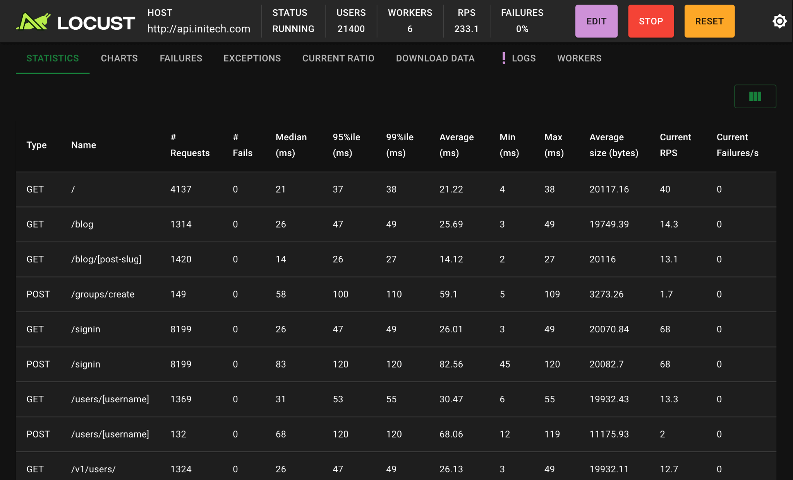
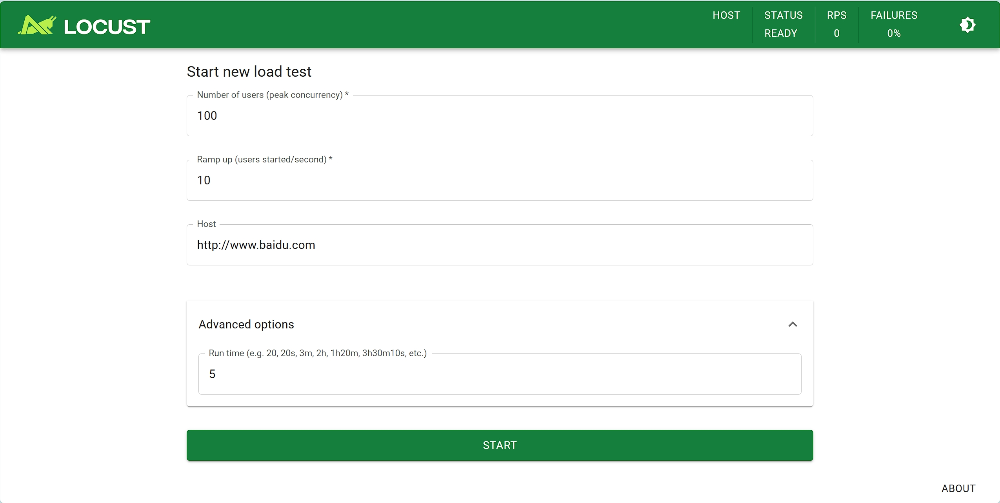
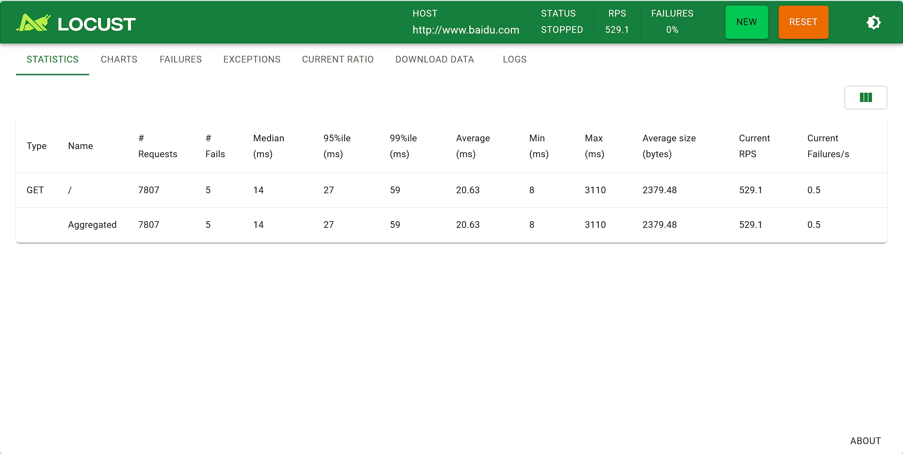
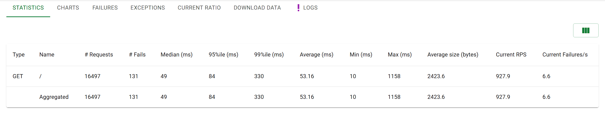
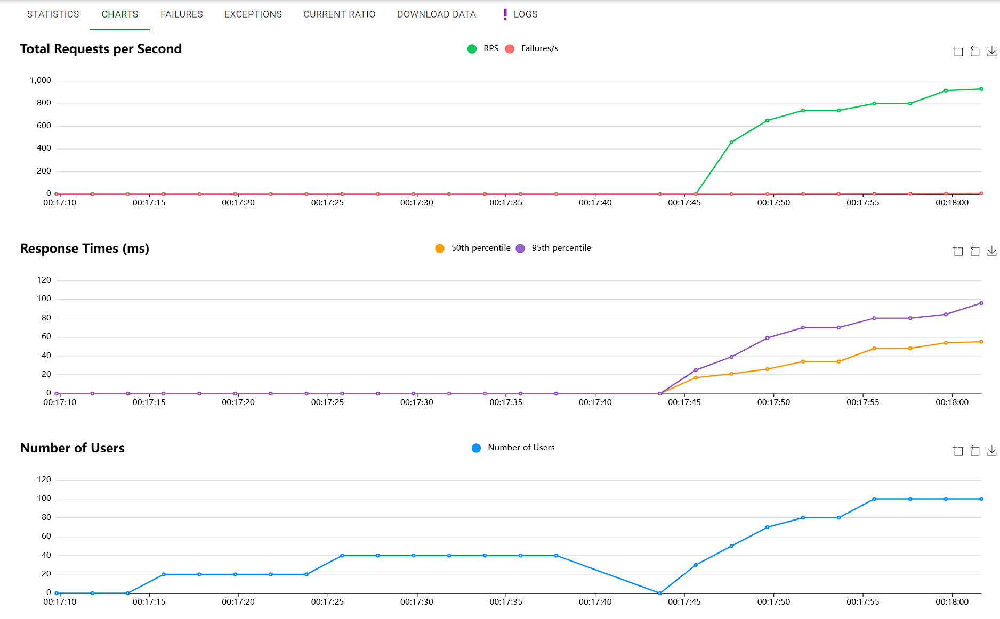
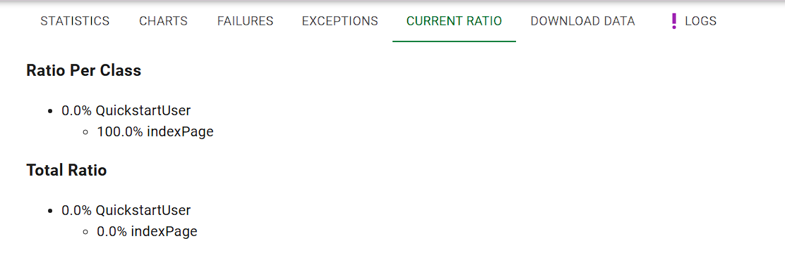
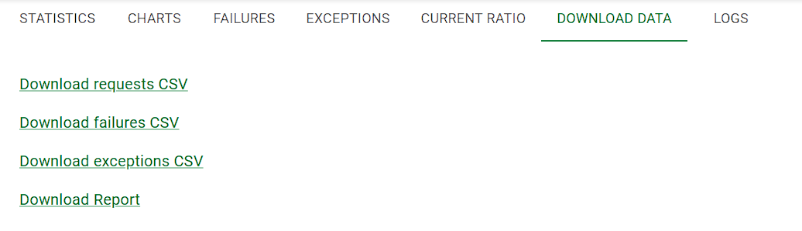
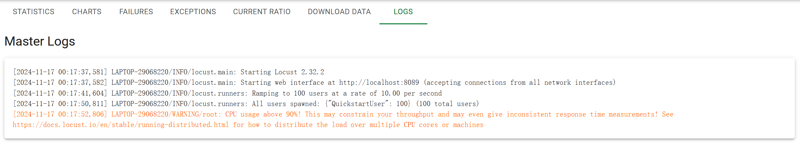

# Locust

## 基础使用

### 简介

官网：https://locust.io/

> An open source load testing tool.

一个开源性能测试工具。

> define user behaviour with python code, and swarm your system with millions of simultaneous users.

使用 Python 代码来定义用户行为。用它可以模拟百万计的并发用户访问你的系统。




### 特点

* 用代码定义用户行为

无需笨重的用户界面或臃肿的XML。只需纯代码。

你可以将常规Python库导入到测试中，并且使用Locust的可插拔架构，它具有无限的可扩展性。与使用大多数其他工具不同，你的测试设计将永远不会受到GUI或特定于领域的语言的限制。

* 支持命令行和GUI两种模式

可以从命令行或使用基于web的UI运行locust测试。UI界面可以更友好的实时查看吞吐量、响应时间和错误，并/或导出以供以后分析。命令行模式更易于集成的 CI/CD 工具。

* 分布式且可扩展

Locust支持在多台机器上分布式运行负载测试，因此可用于模拟数百万的并发用户。

* 能够测试任何系统

虽然locust主要工作与网站/服务，它可以用来测试几乎任何系统或协议。只需为您想要测试的内容编写一个客户端，或者探索社区创建的一些客户端。

插件项目：https://github.com/SvenskaSpel/locust-plugins

* 经过验证且经过实战考验

Locust已被用于模拟数百万的并发用户。战地游戏（Battlefield）的网页应用Battlelog就使用了Locust进行负载测试，因此可以说Locust是真正经过实战考验的；）。

* 支持自定义

locust很小，非常灵活，我们打算保持这种方式。如果你想发送报告数据到你喜欢的数据库和绘图系统，包装调用一个REST API来处理你的系统的细节，或者运行一个完全自定义的负载模式，没有什么能阻止你！


相比较loadrunner和jmeter的优点：

Locust 完全基本 Python 编程语言，采用 Pure Python 描述测试脚本，并且 HTTP 请求完全基于 Requests 库。除了 HTTP/HTTPS 协议，Locust 也可以测试其它协议的系统，只需要采用Python调用对应的库进行请求描述即可。

LoadRunner 和 Jmeter 这类采用进程和线程的测试工具，都很难在单机上模拟出较高的并发压力。Locust 的并发机制摒弃了进程和线程，采用协程（gevent）的机制。协程避免了系统级资源调度，由此可以大幅提高单机的并发能力。


### 安装

github: https://github.com/locustio/locust/

* pip安装

```shell
pip install locust
```

__安装依赖分析__

这里简单介绍 Locust 都基于了哪些库。通过对依赖库的了解，对于locust的实现原理也可以窥探一二。

> ConfigArgParse
> flask
> Flask-Cors
> Flask-Login
> gevent
> geventhttpclient
> msgpack
> psutil
> pywin32
> pyzmq
> requests
> Werkzeug

主要依赖库介绍：

* flask 是 Python 的一个 Web 开发框架。

* gevent 是在 Python 中实现协程的一个第三方库。协程，又称微线程（Coroutine）。使用gevent可以获得极高的并发性能。

* MessagePack是一种高效的二进制序列化格式。它允许您像JSON一样在多种语言之间交换数据。但是它更快，更小。这个包提供了用于读写MessagePack数据的CPython绑定。

* psutil（进程和系统实用程序）是一个跨平台库，用于检索Python中运行的进程和系统利用率（CPU、内存、磁盘、网络、传感器）的信息。它主要用于系统监视、分析和限制进程资源以及管理运行中的进程。

* pyzmq 简介ZMQ是一套嵌入式的网络链接库,是一个基于内存的消息队列,工作起来更像是一个并发式的框架。

* Requests 用来做 HTTP 接口测试。

### 示例

编写简单的性能测试脚本，创建 baidufile.py 文件，通过 Python 编写性能测试脚本。

```py
from locust import HttpUser, task, between

class QuickstartUser(HttpUser):
    wait_time = between(0.1, 0.2)

    @task
    def hello_world(self):
        self.client.get("/")
```

运行命令：

```
locust    # 脚本默认命名为 locustfile

或

locust -f baidufile.py  # 指定脚本的名称
```

浏览器打开：http://127.0.0.1:8089



输入用户并发数，启动时间，基础URL，运行时间（可选项），然后点击开始。

查看运行过程




## 脚本编写

### 脚本解析

locust 脚本默认命名为 `locustfile.py`， 

```python
import time
from locust import HttpUser, task, between


class QuickstartUser(HttpUser):
    wait_time = between(1, 5)

    @task
    def hello_world(self):
        self.client.get("/hello")
        self.client.get("/world")

    @task(3)
    def view_items(self):
        for item_id in range(10):
            self.client.get(f"/item?id={item_id}", name="/item")
            time.sleep(1)

    def on_start(self):
        self.client.post("/login", json={"username": "foo", "password": "bar"})
```

* `QuickstartUser` 类继承`HttpUser`类，用于模拟将要测试的用户。

> HttpUser类为每个用户提供了一个名为client的属性，该属性是一个HttpSession实例，可用于向我们想要加载测试的目标系统发送HTTP请求。当测试开始时，locust会为它模拟的每个用户创建一个该类的实例，并且每个用户都将在自己的绿色gevent线程中开始运行。
> 一个文件要成为有效的`locustfile`文件，必须至少包含一个从`User`继承的类。


* `wait_time` 每个任务执行之后的等待时间的，这里动态 1 ~ 2 秒之间。

* `@task`定义任务。
```py
    @task
    def hello_world(self):
        self.client.get("/hello")
        self.client.get("/world")
```

带有`@task`装饰器的方法是的locust文件的核心。对于每个运行的用户（User），Locust会为其创建一个绿色线程（`协程`或`微线程`），该线程将调用这些方法。

> 任务中的代码是按顺序执行的（它只是普通的Python代码），因此，只有在收到/hello响应后才会调用/world。


* 虚拟用户数分配

```py
    @task
    def hello_world(self):
        ...

    @task(3)
    def view_items(self):
        ...
```

我们通过用`@task`装饰两个方法来声明两个任务，其中一个被赋予了更高的权重(3)。当我们的`QuickstartUser`运行时，它将选择一个声明的任务-在本例中是`hello_world`或`view_items` -并执行它。任务是随机挑选的，但你可以给它们不同的权重。上述配置将使Locust选择`view_items`的可能性是选择`hello_world`的三倍。当任务完成执行后，User将在指定的等待时间内休眠（在本例中为1到5秒）。然后它会选择一个新的任务。

> 注意，只有用`@task`装饰的方法才会被选中，因此您可以按照自己喜欢的方式定义自己的内部助手方法。

* HTTP请求

```py

self.client.get("/hello")
self.client.post("/login", json={"username":"foo", "password":"bar"})
```

`self.client` 属性使得可以进行 HTTP 请求，这些请求将被 Locust 记录下来。有关如何进行其他类型的请求、验证响应等信息，

> 注意：HttpUser不是一个真正的浏览器，因此不会解析HTML响应来加载资源或呈现页面。但它会跟踪cookie。

* 请求分组

```py
  @task(3)
  def view_items(self):
    for item_id in range(10):
        self.client.get(f"/item?id={item_id}", name="/item")
        time.sleep(1)
```

在`view_items`任务中，我们通过使用可变查询参数加载10个不同的url。为了避免在Locust的统计数据中得到10个单独的条目——因为统计数据是按URL分组的——我们使用`name`参数将所有这些请求分组在一个名为`/item`的条目下。

* 前置方法

```py
  def on_start(self):
    ...
```

我们声明了一个`on_start()`方法。当每个模拟用户启动时，将调用具有此名称的方法。

此外，还有与之对应的 `ont_stop()` 方法， 当每个模拟用户启动时，将调用具有此名称的方法。

### User 类

`User`类代表系统的一种类型的用户/场景。在进行测试运行时，指定要模拟的并发用户数量，然后Locust将为每个用户创建一个实例。你可以给这些类/实例添加任何你喜欢的属性，但有一些对蝗虫有特殊意义：

__wait_time 属性__

`wait_time`方法很容易在每个任务执行之后引入延迟。如果没有指定wait_time，则下一个任务将在一个任务完成后立即执行。

```py
from locust import User, task, between

class MyUser(User):
    @task
    def my_task(self):
        print("executing my_task")

     # 每次任务之间等待固定的 3 秒
    wait_time = constant(1)
    # 每次任务之间等待 0.5 到 10 秒之间的随机时间
    wait_time = between(0.5, 10)
    # 每秒最多执行 5 次任务
    wait_time = constant_throughput(5)
    # 每个任务之间至少间隔 2 秒
    wait_time = constant_pacing(2)
```

* `constant`： 使每次任务之间都有一个 固定的时间间隔。
* `between`： 让每个任务之间的等待时间是一个 随机值，范围在指定的最小值和最大值之间。
* `constant_throughput`： 使任务的执行速率保持在 每秒最多 X 次任务。无论每个任务执行多久，Locust 会调整等待时间以维持这个执行速率。
* `constant_pacing`： 确保每个任务之间的 最小间隔时间 是固定的，即确保任务间的等待时间不小于设定的 X 秒。这是 `constant_throughput` 的逆操作。


__weight 和 fixed_count 属性__

如果文件中存在多个用户类，并且在命令行中没有指定用户类，Locust将为每个用户类生成相同数量的用户。你还可以通过将其作为命令行参数传递，从相同的locustfile中指定要使用哪些用户类：

```shell
locust -f locust_file.py WebUser MobileUser
```

如果你希望模拟的某种类型用户数量多于其他类型用户，可以在这些类上设置`weight`（权重）属性。以下代码将使Locust生成的WebUser数量是MobileUser的3倍：

```py
class WebUser(User):
    weight = 3
    ...

class MobileUser(User):
    weight = 1
    ...
```

`fixed_count` 参数在 Locust 中用于指定一个用户类应该生成的固定用户实例数量。

这个参数非常有用，当你需要确保某些特定类型的用户（例如管理员或特定测试场景中的用户）在测试期间始终以固定数量存在时。

在下面的示例中，只生成一个AdminUser实例，以便在独立于总用户数量的情况下，对请求数量进行更精确的控制，以完成一些特定工作。

```py
class AdminUser(User):
    wait_time = constant(600)
    fixed_count = 1

    @task
    def restart_app(self):
        ...

class WebUser(User):
    ...
```

__host 属性__

host属性是要测试的主机的URL前缀（例如https://google.com）。它会自动添加到请求中，因此你以执行self.client.get（"/"）等操作。

```py
from locust import User

class MyUser(User):
    host = "https://www.baidu.com"
```

### HttpUser类

HttpUser是最常用的User。它添加了一个用于发出HTTP请求的客户端属性。

__client属性 / HttpSession__

client是HttpSession的一个实例。HttpSession是requests.Session的一个子类/封装，因此它的功能都有详细的文档记录，并且对于许多人来说应该是熟悉的。HttpSession主要增加的功能是将请求结果报告给Locust（成功/失败、响应时间、响应长度、名称）。

它包含了所有HTTP方法的方法：get、post、put、……

就像requests.Session一样，它在请求之间保留cookies，因此它可以很容易地用于登录网站。

发送一个POST请求，查看响应，并隐式地重用我们在第二个请求中获得的任何会话cookie

```python
response = self.client.post("/login", {"username":"testuser", "password":"secret"})
print("响应状态码:", response.status_code)
print("响应文本:", response.text)
response = self.client.get("/my-profile")
```

HttpSession会捕获Session抛出的任何requests.RequestException（由连接错误、超时或类似原因引起），而不是返回一个状态码设置为0和内容设置为None的虚拟Response对象。

__验证响应__

如果HTTP响应代码是OK（<400），则请求被认为是成功的，但通常对响应进行一些额外的验证是很有用的。

你可以通过使用catch_response参数、with语句和对response.failure()的调用来将请求标记为失败

```python
with self.client.get("/", catch_response=True) as response:
    if response.text != "Success":
        response.failure("得到了错误的响应")
    elif response.elapsed.total_seconds() > 0.5:
        response.failure("请求耗时过长")
```

你也可以将请求标记为成功，即使响应代码不好：

```python
with self.client.get("/does_not_exist/", catch_response=True) as response:
    if response.status_code == 404:
        response.success()
```

你甚至可以通过在with块外部抛出异常然后捕获它，或者抛出locust异常（如下面的示例所示并让Locust捕获它）来完全避免记录请求。

```python
from locust.exception import RescheduleTask
...
with self.client.get("/does_not_exist/", catch_response=True) as response:
    if response.status_code == 404:
        raise RescheduleTask()
```

__REST/JSON APIs__

FastHttpUser提供了一个现成的rest方法，但你也可以自己来做：

```python
from json import JSONDecodeError
...
with self.client.post("/", json={"foo": 42, "bar": None}, catch_response=True) as response:
    try:
        if response.json()["greeting"] != "hello":
            response.failure("在greeting中没有得到预期的值")
    except JSONDecodeError:
        response.failure("响应无法解码为JSON")
    except KeyError:
        response.failure("响应不包含预期的键'greeting'")
```

__请求分组__

对于网站来说，其页面的URL包含某种动态参数是很常见的。通常将这些URL在用户统计信息中组合在一起是有意义的。这可以通过向HttpSession的不同请求方法传递一个name参数来实现。

示例：

```python
# 这些请求的统计数据将被分组在：/blog/?id=[id]
for i in range(10):
    self.client.get("/blog?id=%i" % i, name="/blog?id=[id]")
```

当与包装Requests会话的库/SDK交互时，可能无法将参数传入请求函数，此时提供了另一种请求分组方式，即通过设置client.request_name属性。

```python
# 这些请求的统计数据将被分组在：/blog/?id=[id]
self.client.request_name="/blog?id=[id]"
for i in range(10):
    self.client.get("/blog?id=%i" % i)
self.client.request_name=None
```

如果你想用最少的样板代码链接多个分组，你可以使用client.rename_request()上下文管理器。

```python
@task
def multiple_groupings_example(self):
    # 这些请求的统计数据将被分组在：/blog/?id=[id]
    with self.client.rename_request("/blog?id=[id]"):
        for i in range(10):
            self.client.get("/blog?id=%i" % i)

    # 这些请求的统计数据将被分组在：/article/?id=[id]
    with self.client.rename_request("/article?id=[id]"):
        for i in range(10):
            self.client.get("/article?id=%i" % i)
```

使用catch_response并直接访问request_meta，你甚至可以根据响应中的某些内容来重命名请求。

```python
with self.client.get("/", catch_response=True) as resp:
    resp.request_meta["name"] = resp.json()["name"]
```

__HTTP代理设置__

为了提高性能，我们通过将requests.Session的`trust_env`属性设置为False来配置requests，使其不在环境中查找HTTP代理设置。如果你不想这样做，你可以手动将`locust_instance.client.trust_env`设置为True。

有关详细信息，请参阅requests的文档。
https://requests.readthedocs.io/en/latest/api/#requests.Session.trust_env


**连接重用**

默认情况下，连接会被HttpUser重用，甚至跨任务运行。要避免连接重用，你可以这样做：

```python
self.client.get("/", headers={"Connection": "close"})
self.client.get("/new_connection_here")
```

或者你可以关闭整个requests.Session对象（这也会删除cookies、关闭SSL会话等）。这有一些CPU开销（并且由于SSL重新协商等原因，下一个请求的响应时间会更长），所以除非你真的需要，否则不要使用它。

```python
self.client.get("/")
self.client.close()
self.client.get("/new_connection_here")
```

__连接池__

由于每个HttpUser都会创建一个新的HttpSession，因此每个用户实例都有自己的连接池。这与真实用户（浏览器）与Web服务器交互的方式相似。

如果你反而想共享连接，你可以使用一个池管理器。要做到这一点，请将pool_manager类属性设置为urllib3.PoolManager的一个实例。

```python
from locust import HttpUser
from urllib3 import PoolManager

class MyUser(HttpUser):
    # 这个类的所有实例都将被限制为最多10个并发连接。
    pool_manager = PoolManager(maxsize=10, block=True)
```

有关更多配置选项，请参阅urllib3的文档。
https://urllib3.readthedocs.io/en/stable/reference/urllib3.poolmanager.html

### Tasks

当启动负载测试时，将为每个模拟用户创建一个User类的实例，并且它们将在自己的greenlet中开始运行。当这些用户运行时，他们选择要执行的任务，休息一会儿，然后选择一个新任务，以此类推。


__@task 装饰器__

为User添加任务的最简单方式是使用task装饰器。

```python
from locust import User, task, constant

class MyUser(User):
    wait_time = constant(1)

    @task
    def my_task(self):
        print("User instance (%r) executing my_task" % self)
```
@task 接受一个可选的weight参数，可以用来指定任务的执行比例。在以下示例中，task2被选中执行的可能性是task1的两倍：

```python
from locust import User, task, between

class MyUser(User):
    wait_time = between(5, 15)

    @task(3)
    def task1(self):
        pass

    @task(6)
    def task2(self):
        pass
```

__tasks 属性__

另一种定义User任务的方式是通过设置tasks属性。

tasks属性要么是一个Tasks列表，要么是一个<Task : int>字典，其中Task可以是Python可调用对象或TaskSet类。如果任务是普通的Python函数，它们将接收一个参数，即执行任务的User实例。

以下是一个作为普通Python函数声明的User任务的示例：

```python
from locust import User, constant

def my_task(user):
    pass

class MyUser(User):
    tasks = [my_task]
    wait_time = constant(1)
```
如果tasks属性被指定为一个列表，每次要执行任务时，将从tasks属性中随机选择。然而，如果tasks是一个字典——键是可调用对象，值是整数——要执行的任务将随机选择，但整数作为比例。所以，有一个像这样的任务：

```python
{my_task: 3, another_task: 1}
```
my_task被执行的可能性是another_task的3倍。

内部地，上述字典实际上会被展开成一个列表（并且tasks属性被更新），看起来像这样：

```python
[my_task, my_task, my_task, another_task]
```
然后使用Python的random.choice()从列表中挑选任务。

__@tag 装饰器__

通过使用@tag装饰器给任务打标签，你可以在使用--tags和--exclude-tags参数时挑剔地选择哪些任务在测试期间执行。考虑以下示例：

```python
from locust import User, constant, task, tag

class MyUser(User):
    wait_time = constant(1)

    @tag('tag1')
    @task
    def task1(self):
        pass

    @tag('tag1', 'tag2')
    @task
    def task2(self):
        pass

    @tag('tag3')
    @task
    def task3(self):
        pass

    @task
    def task4(self):
        pass
```
如果你用--tags tag1开始这个测试，那么在测试期间只有task1和task2会被执行。如果你用--tags tag2 tag3开始它，只有task2和task3会被执行。

--exclude-tags的行为完全相反。所以，如果你用--exclude-tags tag3开始测试，只有task1、task2和task4会被执行。排除总是胜过包含，所以如果一个任务有一个你已经包含的标签和一个你已经排除的标签，它将不会被执行。


### Event 

如果你想在测试中运行一些设置代码，通常只需将其放在locustfile的模块级别就足够了，但有时你需要在运行的特定时间点做一些事情。为了满足这一需求，Locust提供了事件钩子。

__`test_start` 和 `test_stop`__

如果你需要在负载测试的开始或停止时运行一些代码，你应该使用test_start和test_stop事件。你可以在locustfile的模块级别设置这些事件的监听器：

```python
from locust import events

@events.test_start.add_listener
def on_test_start(environment, **kwargs):
    print("A new test is starting")

@events.test_stop.add_listener
def on_test_stop(environment, **kwargs):
    print("A new test is ending")
```

__init__

init事件在每个Locust进程的开始时触发。这在分布式模式下特别有用，每个工作进程（而不是每个用户）都需要有机会进行一些初始化。例如，假设你有一些全局状态，从这个进程生成的所有用户都需要：

```python
from locust import events
from locust.runners import MasterRunner

@events.init.add_listener
def on_locust_init(environment, **kwargs):
    if isinstance(environment.runner, MasterRunner):
        print("I'm on master node")
    else:
        print("I'm on a worker or standalone node")
```

__其他事件__

请参阅使用事件钩子扩展Locust以了解其他事件以及如何使用它们的更多示例。
https://docs.locust.io/en/stable/extending-locust.html#extending-locust


### 织你测试代码

重要的是要记住，locustfile.py只是一个普通的Python模块，由Locust导入。从这个模块中，你可以像在任何Python程序中一样自由地导入其他Python代码。当前工作目录会自动添加到python的sys.path中，因此任何位于工作目录中的Python文件/模块/包都可以使用python import语句导入。

对于小型测试，将所有测试代码都保留在单个locustfile.py中应该可以正常工作，但对于更大的测试套件，你可能希望将代码分割到多个文件和目录中。

你如何组织测试源代码当然完全取决于你，但我们建议你遵循Python的最佳实践。这里是一个虚构的Locust项目的示例文件结构：

```shell
common/
  __init__.py
  auth.py
  config.py
locustfile.py
requirements.txt
```

具有多个locustfiles的项目也可以将它们保存在单独的子目录中：

```shell
common/
  __init__.py
  auth.py
  config.py
my_locustfiles/
  api.py
  website.py
requirements.txt
```

使用上述任何项目结构，你的locustfile都可以使用以下方式导入通用库：

```python
import common.auth
```

## 命令行工具

Locust主要通过命令行参数配置。

* 查看帮助

```shell
locust --help
```

### 参数说明

以下是Locust命令行选项的表格形式，包括每个选项的说明：

| 选项                                         | 说明                                                                                                                                                          |
| -------------------------------------------- | ------------------------------------------------------------------------------------------------------------------------------------------------------------- |
| `-h, --help`                                 | 显示帮助信息并退出                                                                                                                                            |
| `-f <filename>, --locustfile <filename>`     | 包含测试的Python文件或模块，例如`my_test.py`。接受多个逗号分隔的.py文件、包名/目录或远程locustfile的URL。默认为`locustfile`。                                 |
| `--config <filename>`                        | 读取额外配置的文件。                                                                                                                                          |
| `-H <base url>, --host <base url>`           | 要进行负载测试的主机，格式如下：https://www.example.com                                                                                                       |
| `-u <int>, --users <int>`                    | 同时运行的Locust用户的最大数量。主要与`--headless`或`--autostart`一起使用。可以在测试期间通过键盘输入w, W（生成1, 10个用户）和s, S（停止1, 10个用户）来更改。 |
| `-r <float>, --spawn-rate <float>`           | 用户生成速率（每秒用户数）。主要与`--headless`或`--autostart`一起使用。                                                                                       |
| `-t <time string>, --run-time <time string>` | 指定运行时间后停止，例如(300s, 20m, 3h, 1h30m等)。仅与`--headless`或`--autostart`一起使用。默认为永久运行。                                                   |
| `-l, --list`                                 | 显示可能的用户类列表并退出。                                                                                                                                  |
| `--config-users [CONFIG_USERS ...]`          | 用户配置，可以是JSON字符串或文件。可以提供参数列表或JSON配置数组。                                                                                            |

**Web UI选项：**
| 选项                                         | 说明                                                                                                         |
| -------------------------------------------- | ------------------------------------------------------------------------------------------------------------ |
| `--web-host <ip>`                            | 绑定Web界面的主机。默认为`*`（所有接口）。                                                                   |
| `--web-port <port number>, -P <port number>` | 运行Web主机的端口。                                                                                          |
| `--headless`                                 | 禁用Web界面，并立即开始测试。使用`-u`和`-t`控制用户数量和运行时间。                                          |
| `--autostart`                                | 立即开始测试（像`--headless`，但不禁用Web UI）。                                                             |
| `--autoquit <seconds>`                       | 在运行完成后的X秒后完全退出Locust。仅与`--autostart`一起使用。默认为保持Locust运行，直到你使用CTRL+C关闭它。 |
| `--web-login`                                | 使用登录页面保护Web界面。                                                                                    |
| `--tls-cert <filename>`                      | 用于HTTPS服务的TLS证书的可选路径。                                                                           |
| `--tls-key <filename>`                       | 用于HTTPS服务的TLS私钥的可选路径。                                                                           |
| `--class-picker`                             | 在Web界面中启用选择框，以从所有可用的用户类和形状类中选择。                                                  |

**Master选项：**
| 选项                               | 说明                                                                                 |
| ---------------------------------- | ------------------------------------------------------------------------------------ |
| `--master`                         | 作为主节点启动Locust，工作节点连接到它。                                             |
| `--master-bind-host <ip>`          | 主节点监听的IP地址。默认为*（所有可用接口）。                                        |
| `--master-bind-port <port number>` | 主节点监听的端口。默认为5557。                                                       |
| `--expect-workers <int>`           | 延迟开始测试，直到连接到这个数量的工作节点（仅与`--headless/--autostart`组合使用）。 |
| `--expect-workers-max-wait <int>`  | 主节点等待工作节点连接的时间，直到放弃。默认为永远等待。                             |
| `--enable-rebalancing`             | 如果在测试运行期间添加或移除新工作节点，则重新分配用户。实验性功能。                 |

**Worker选项：**
| 选项                          | 说明                                                                                                                                                        |
| ----------------------------- | ----------------------------------------------------------------------------------------------------------------------------------------------------------- |
| `--worker`                    | 设置Locust以分布式模式运行，此进程作为工作节点。可以与设置`--locustfile`为`-`结合使用，从主节点下载它。                                                     |
| `--processes <int>`           | Locust进程的分叉次数，以启用系统使用。与`--worker`标志结合使用，或让它自动设置`--worker`和`--master`标志的一体化解决方案。Windows系统上不可用。实验性功能。 |
| `--master-host <hostname>`    | 要连接的Locust主节点的主机名。默认为127.0.0.1。                                                                                                             |
| `--master-port <port number>` | 在主节点上连接的端口。默认为5557。                                                                                                                          |

**标签选项：**
| 选项                                         | 说明                                                         |
| -------------------------------------------- | ------------------------------------------------------------ |
| `-T [<tag> ...], --tags [<tag> ...]`         | 要在测试中包括的标签列表，只有这样的任务才会被执行。         |
| `-E [<tag> ...], --exclude-tags [<tag> ...]` | 要从测试中排除的标签列表，只有没有匹配标签的任务才会被执行。 |

**请求统计信息选项：**
| 选项                 | 说明                                                                                                                                               |
| -------------------- | -------------------------------------------------------------------------------------------------------------------------------------------------- |
| `--csv <filename>`   | 以CSV格式将请求统计信息存储在文件中。设置此选项将生成三个文件：`<filename>_stats.csv`, `<filename>_stats_history.csv`和`<filename>_failures.csv`。 |
| `--csv-full-history` | 将每个统计条目以CSV格式存储到`_stats_history.csv`文件中。必须同时指定`--csv`参数以启用此功能。                                                     |
| `--print-stats`      | 在UI运行期间启用定期打印请求统计信息。                                                                                                             |
| `--only-summary`     | 在`--headless`运行期间禁用定期打印请求统计信息。                                                                                                   |
| `--reset-stats`      | 生成完成后重置统计信息。在分布式模式运行时，需要在主节点和工作节点上都设置。                                                                       |
| `--html <filename>`  | 将HTML报告存储在指定的文件路径中。                                                                                                                 |
| `--json`             | 将最终统计信息以JSON格式打印到stdout。与`--headless`和`--skip-log`一起使用，仅输出json数据非常有用。                                               |

**日志记录选项：**
| 选项                             | 说明                                                                 |
| -------------------------------- | -------------------------------------------------------------------- |
| `--skip-log-setup`               | 禁用Locust的日志记录设置。相反，配置由Locust测试或Python默认值提供。 |
| `--loglevel <level>, -L <level>` | 选择DEBUG/INFO/WARNING/ERROR/CRITICAL之间的日志级别。默认为INFO。    |
| `--logfile <filename>`           | 日志文件的路径。如果未设置，日志将输出到stderr。                     |

**其他选项：**
| 选项                                   | 说明                                                                                                    |
| -------------------------------------- | ------------------------------------------------------------------------------------------------------- |
| `--show-task-ratio`                    | 打印用户类的任务执行比例表。如果某些类定义了非零fixed_count属性，请与非零`--user`选项一起使用。         |
| `--show-task-ratio-json`               | 打印用户类的任务执行比例的JSON数据。如果某些类定义了非零fixed_count属性，请与非零`--user`选项一起使用。 |
| `--version, -V`                        | 显示程序的版本号并退出。                                                                                |
| `--exit-code-on-error <int>`           | 设置当测试结果包含任何失败或错误时使用的进程退出代码。默认为1。                                         |
| `-s <number>, --stop-timeout <number>` | 等待模拟用户完成任何执行任务的秒数，然后退出。默认为立即终止。在分布式运行时，这只需要在主节点上指定。  |
| `--equal-weights`                      | 使用等量分布的任务权重，覆盖locustfile中指定的权重。                                                    |

**用户类：**
| 选项                      | 说明                                                                                                                                                          |
| ------------------------- | ------------------------------------------------------------------------------------------------------------------------------------------------------------- |
| `<UserClass1 UserClass2>` | 在命令行的末尾，你可以列出要使用的用户类（可用用户类可以通过`--list`列出）。也可以使用环境变量`LOCUST_USER_CLASSES`来指定用户类。默认是使用所有可用的用户类。 |

**示例：**
| 命令                                                                   | 说明                                                                                                      |
| ---------------------------------------------------------------------- | --------------------------------------------------------------------------------------------------------- |
| `locust -f my_test.py -H https://www.example.com`                      | 运行`my_test.py`测试脚本，测试目标为`https://www.example.com`。                                           |
| `locust --headless -u 100 -t 20m --processes 4 MyHttpUser AnotherUser` | 以无头模式运行测试，最多100个用户，运行时间20分钟，分叉4个进程，并指定`MyHttpUser`和`AnotherUser`用户类。 |

更多详细信息，包括如何通过文件或环境变量设置选项，请参见文档：[Locust Configuration](https://docs.locust.io/en/stable/configuration.html)。


### 无界面模式

你可以通过使用`--headless`标志与`-u/--users`和`-r/--spawn-rate`一起运行Locust，而不需要Web界面：

```shell
locust -f locust_files/my_locust_file.py --headless -u 100 -r 5

[2021-07-24 10:41:10,947] .../INFO/locust.main: No run time limit set, use CTRL+C to interrupt.
[2021-07-24 10:41:10,947] .../INFO/locust.main: Starting Locust 2.32.2
[2021-07-24 10:41:10,949] .../INFO/locust.runners: Ramping to 100 users using a 5.00 spawn rate
Name              # reqs      # fails  |     Avg     Min     Max  Median  |   req/s failures/s
----------------------------------------------------------------------------------------------

GET /hello             1     0(0.00%)  |     115     115     115     115  |    0.00    0.00
GET /world             1     0(0.00%)  |     119     119     119     119  |    0.00    0.00
----------------------------------------------------------------------------------------------

Aggregated             2     0(0.00%)  |     117     115     119     117  |    0.00    0.00
```
即使在无头模式下，你也可以在测试运行时更改用户数量。按`w`增加1个用户，或按`W`增加10个用户。按`s`减少1个用户，或按`S`减少10个用户。

__为测试设置时间限制__

要指定测试的运行时间，请使用`-t/--run-time`：

```shell
locust --headless -u 100 --run-time 1h30m
locust --headless -u 100 --run-time 60 # default unit is seconds
```
Locust将在时间到达后关闭。时间从测试开始时计算（而不是从增加用户完成时开始）。

__允许任务在关闭时完成迭代__

默认情况下，Locust会立即停止你的任务（甚至不等待请求完成）。要给运行中的任务一些时间来完成它们的迭代，请使用`-s/--stop-timeout`：

```shell
locust --headless --run-time 1h30m --stop-timeout 10s
```

__控制Locust进程的退出代码__

默认情况下，如果有任何失败的样本，locust进程将给出1的退出代码（使用`--exit-code-on-error`来更改该行为）。

你还可以通过设置Environment实例的process_exit_code在你的测试脚本中手动控制退出代码。这在作为自动化/计划测试运行Locust时特别有用，例如作为CI管道的一部分。

以下是一个示例，如果满足以下任何条件，它将把退出代码设置为非零：

- 超过1%的请求失败
- 平均响应时间超过200毫秒
- 响应时间的95百分位数大于800毫秒

```python
import logging
from locust import events

@events.quitting.add_listener
def _(environment, **kw):
    if environment.stats.total.fail_ratio > 0.01:
        logging.error("Test failed due to failure ratio > 1%")
        environment.process_exit_code = 1
    elif environment.stats.total.avg_response_time > 200:
        logging.error("Test failed due to average response time ratio > 200 ms")
        environment.process_exit_code = 1
    elif environment.stats.total.get_response_time_percentile(0.95) > 800:
        logging.error("Test failed due to 95th percentile response time > 800 ms")
        environment.process_exit_code = 1
    else:
        environment.process_exit_code = 0
```
注意，这段代码可以放在`locustfile.py`或任何其他在`locustfile`中导入的文件中。


## locust 分布式运行

单个进程运行Locust可以模拟相当高的吞吐量。对于简单的测试计划和小负载，它可以每秒发出超过一千个请求，如果使用FastHttpUser，可能会超过一万个请求。

但是，如果你的测试计划复杂，或者你想要施加更大的负载，你需要扩展到多个进程，甚至可能是多个机器。幸运的是，Locust开箱即用地支持分布式运行。

为此，你需要启动一个带有`--master`标志的Locust实例，以及一个或多个带有`--worker`标志的实例。主实例运行Locust的Web界面，并告诉工作节点何时生成/停止用户。工作实例运行你的用户并将统计信息发送回主节点。主实例本身不运行任何用户。

为了简化启动，你可以使用`--processes`标志。它将启动一个主进程和指定数量的工作进程。它也可以与`--worker`结合使用，这样它只会启动工作节点。此功能依赖于`fork()`，因此在Windows上无法使用。

> 注意
> 由于Python无法充分利用每个进程的多个核心（参见GIL），你需要为每个处理器核心运行一个工作实例，以便访问所有计算能力。

> 注意
> 每个工作节点可以运行的用户数量几乎没有限制。Locust/gevent可以每个进程运行数千甚至数万个用户，只要它们的总请求速率（RPS）不太高。

如果Locust接近耗尽CPU资源，它将记录一个警告。如果没有警告，但你仍然无法生成预期的负载，那么问题可能是请求速率不足。


* 架构图

```
                         +--------------------------+
                         |      主节点（Master）   |
                         |      使用 locust-swarm   |
                         +-------------+------------+
                                       |
           +---------------------------+---------------------------+
           |                           |                           |
+----------v---------+     +-----------v---------+     +-----------v---------+
|  节点1（worker）    |     |   节点1（worker）    |     |   节点1（worker）|
|  locust 节点服务    |     |    locust 节点服务   |     | locust 节点服务     |
+---------------------+     +---------------------+     +---------------------+
```

__单机__

启动一个主节点和4个工作进程非常简单：

```shell
locust --processes 4
```
你甚至可以自动检测机器中的逻辑核心数量，并为每个核心启动一个工作节点：

```shell
locust --processes -1
```


__多台机器__

在一台机器上以主模式启动Locust：

```shell
locust -f .\baidufile.py --master

[2024-11-09 16:07:54,984] LAPTOP-29068220/INFO/locust.main: Starting Locust 2.32.1
Error resolving address: [Errno 11001] getaddrinfo failed
[2024-11-09 16:07:55,029] LAPTOP-29068220/INFO/locust.main: Starting web interface at http://localhost:8089 (accepting connections from all network interfaces)
[2024-11-09 16:09:40,059] LAPTOP-29068220/INFO/locust.runners: fnngjdeMacBook-Pro.local_b5522632a57d49f7b68e556150ed2fa6 (index 0) reported as ready. 1 workers connected.
[2024-11-09 16:09:40,059] LAPTOP-29068220/INFO/locust.runners: fnngjdeMacBook-Pro.local_16263ab894d34f0f8d7001fba8674ea9 (index 1) reported as ready. 2 workers connected.
[2024-11-09 16:09:40,060] LAPTOP-29068220/INFO/locust.runners: fnngjdeMacBook-Pro.local_e29d2512417f4a32a6c60e65eb9100af (index 2) reported as ready. 3 workers connected.
[2024-11-09 16:09:40,060] LAPTOP-29068220/INFO/locust.runners: fnngjdeMacBook-Pro.local_c29f185756594353aacd207b28e1b203 (index 3) reported as ready. 4 workers connected.
```

然后在每个工作机器上：

```shell
locust -f - --worker --master-host 192.168.0.5 --processes 4       

[2024-11-09 16:09:38,882] fnngjdeMacBook-Pro/INFO/locust.main: Starting Locust 2.32.2
```

`192.168.0.5` 是master主节点的IP地址。

> 注意
> `-f -`参数告诉Locust从主节点获取locustfile，而不是从其本地文件系统获取。此功能是在Locust 2.23.0中引入的。

运行性能测试，工作机的CPU占用。


通过查看CPU占用，基本与 `--processes 4` 的配置吻合。


__分布式负载生成选项__

* `--master-host <hostname or ip>`
可选地与`--worker`一起使用，以设置主节点的主机名/IP（默认为localhost）。

* `--master-port <port number>`
可选地与`--worker`一起使用，以设置主节点的端口号（默认为5557）。

* `--master-bind-host <ip>`
可选地与`--master`一起使用。确定主节点将绑定到哪个网络接口。默认为*（所有可用接口）。

* `--master-bind-port <port number>`
可选地与`--master`一起使用。确定主节点将监听哪些网络端口。默认为5557。

* `--expect-workers <number of workers>`
在以`--headless`启动主节点时使用。主节点将在X个工作节点连接后等待，然后才开始测试。


## locust-swarm 分布式运行

Swarm是一个使用rsync和ssh实现分布式locust运行自动化的脚本。

>  rsync -- 一个快速、通用、远程（和本地）文件复制工具
> 
当你对locustfile进行更改时，你需要重新启动所有Locust进程。locust-swarm为你自动化了这一过程。它还解决了工作节点到主节点的防火墙/网络访问问题，使用SSH隧道（如果主节点在你的工作站上而工作节点在某个数据中心运行，这通常是一个问题）。


### 架构与流程 

* 架构图

```
                         +--------------------------+
                         |      控制节点（Master）   |
                         |      使用 locust-swarm   |
                         +-------------+------------+
                                       |
           +---------------------------+---------------------------+
           |                           |                           |
+----------v---------+     +-----------v---------+     +-----------v---------+
|  负载机1（loadengs）|     |   负载机2（loadengs） |    |   负载机3（loadengs）|
|  locust 节点服务    |     |    locust 节点服务   |     | locust 节点服务     |
+---------------------+     +---------------------+     +---------------------+
```

* 流程图


这张图清晰地展示了 Swarm 的工作流程，包括如何准备和运行分布式负载测试。

**Acquire loadgens**（获取负载生成器）
1. **Check availability (ssh)**  - 检查负载生成器的可用性（通过 SSH）。

2. **Start semaphore process to reserve loadgen (ssh)**  - 启动信号量进程以预留负载生成器（通过 SSH）。

**Prepare your SUT, test data etc**（准备 SUT 和测试数据）
3. **Upload test plan and (optionally) test data files (rsync)**  - 上传测试计划和（可选的）测试数据文件（通过 rsync）。

**Generate load**（生成负载）
4. **Start locust (ssh)**  - 启动 Locust（通过 SSH）。

**Locust**（负载测试阶段）
5. **Actual load (http, kafka, …)**  - 生成实际负载（例如 HTTP、Kafka 等流量）。
6. **Log sample data**  - 记录示例数据。

**Postprocessing**（后处理）
7. **Validate thresholds (response times, error rates, etc), calculate and save aggregated metrics**  - 验证指标（响应时间、错误率等），计算并保存聚合指标。

**View the report in Grafana**（在 Grafana 中查看报告）
8. 在 Grafana 中查看最终的测试报告。

名词说明：
- **Master**：负责协调测试的主节点。
- **Loadgens**：运行 Locust Worker 的负载生成器节点。
- **SUT**：系统被测（System Under Test）。
- **Timescale**：用于存储测试数据的数据库。

### 安装与使用

__条件：我们准备两台主机，主机1 和 主机 2，需要将两台主机支持 SSH 无密码登录。__


* `主机1`，安装命令

```shell
pip install locust
pip install locust-swarm
```

* `主机2`，安装命令

```shell
pip install locust
```

* `主机1`，生成密钥

```shell
ssh-keygen -t rsa
```

* `主机1`, 查看公钥, 将公钥复制到`主机2`, `主机2`文件路径： `.ssh/authorized_keys`

```shell
vim authorized_keys  # 编辑文件，将公钥复制进去。保存退出
```

* `主机1`, 设置登录`主机2`用户名, `主机1`文件路径`.ssh/config`

```shell
Host 47.106.0.205  # 主机2的 IP
    User root
```

* `主机1`尝试 SSH 无密码登录

```
ssh 47.106.0.205
```

主机1 运行

```
swarm --loadgen-list 47.106.0.205 -t 10 --users 10 -f baidufile.py -H https://www.baidu.com
```

主机2 CPU 占用

* 启动命令

```shell

swarm --loadgen-list 47.106.237.205 -t 10 --users 10 -f baidufile.py -H https://www.baidu.com

2024-11-16:19:26:12,428 INFO [swarm.py:545] launching master: locust --master --master-bind-port 5557 --master-bind-host=127.0.0.1 --expect-workers 4 --expect-workers-max-wait 60 --headless -f baidufile.py --run-time=10 --exit-code-on-error 0 --users 10 -H https://www.baidu.com
2024-11-16:19:26:12,432 INFO [swarm.py:400] workers started ssh -q -R 5557:localhost:5557 -R 5558:localhost:5558 47.106.237.205 ' PYTHONUNBUFFERED=1 locust --worker --processes 4 --master-port 5557 --headless --expect-workers-max-wait 30 -f - & read; kill -9 $! '

...

[2024-11-16 19:27:55,672] LAPTOP-29068220/INFO/locust.runners: The last worker quit, stopping test.
[2024-11-16 19:27:56,627] LAPTOP-29068220/INFO/locust.main: Shutting down (exit code 0)
| Type     Name                                  # reqs      # fails | Avg     Min     Max    Med           | req/s  failures/s |
| ------------------------------------------------------------------ | ------------------------------------ | ----------------- | 

| GET      /                                        321     0(0.00%) | 14       8     481     10            | 32.44        0.00 |
| --------                                                           | ------------------------------------ | -------           |
| Aggregated                               321     0(0.00%)          | 14       8     481     10            | 32.44        0.00 |

Response time percentiles (approximated)
Type     Name                                          50%    66%    75%    80%    90%    95%    98%    99%  99.9% 99.99%   100% # reqs
--------|----------------------------------------|--------|------|------|------|------|------|------|------|------|------|------|------
GET      /                                              10     11     12     12     15     36     43     84    480    480    480    321
--------|----------------------------------------|--------|------|------|------|------|------|------|------|------|------|------|------
         Aggregated                                     10     11     12     12     15     36     43     84    480    480    480    321
```

有关更多详细信息，请参见locust-swarm。

https://github.com/SvenskaSpel/locust-swarm

__重点__

1. 主机1 与 主机2 （主机3，主机4，更多）必须可以通过 SSH 无密码登录。
2. 主机1 不支持Windows系统。


### 两种分布式对比

__locust 分布式__

1. 局域网，相互可ping的通过。
2. 需要启动`master` 和 `worker`。

__locust 分布式__

1. 不要求网络，必须 SSH 无密码登录。
2. 只需要 master 控制脚本执行。

## 更快快的HTTP客户端

Locust的默认HTTP客户端使用的是python-requests。

它提供了一个许多Python开发者都熟悉的良好API，并且维护得非常好。但是，如果您计划以非常高的吞吐量运行测试，并且运行Locust的硬件有限，它有时可能不够高效。

因此，Locust还提供了`FastHttpUser`，它使用的是geventhttpclient。

GitHub地址：https://github.com/geventhttpclient/geventhttpclient

它提供了一个非常相似的API，并且使用的CPU时间要少得多，有时可以在相同的硬件上将每秒请求的最大数量提高5倍至6倍。

在最佳情况下（在`while True`循环中进行小请求），一个Locust进程（限制在一个CPU核心）可以使用FastHttpUser每秒处理大约**16000个请求，而使用HttpUser则为4000个**（在2021年M1 MacBook Pro和Python 3.11上测试）。

对于更大的请求负载，相对改进可能更大，但如果您的测试正在进行与请求无关的CPU密集型操作，改进也可能更小。

当然，在现实中，您应该每个CPU核心运行一个Locust进程。

注意：

只要你的负载生成器CPU没有过载，FastHttpUser的响应时间应该与HttpUser几乎相同。它不会使单个请求更快。

### 使用FastHttpUser

只需将FastHttpUser而不是HttpUser作为子类即可：

```python
from locust import task, FastHttpUser

class MyUser(FastHttpUser):
    @task
    def index(self):
        response = self.client.get("/")
```

### 并发性

一个FastHttpUser/geventhttpclient会话可以运行并发请求，只需要为每个请求启动greenlets：

```python
import gevent
from gevent import monkey
monkey.patch_all()

from locust import task, FastHttpUser

class MyUser(FastHttpUser):
    @task
    def index(self):
        def concurrent_request(url):
            self.client.get(url)

        pool = gevent.pool.Pool()
        urls = ["/url1", "/url2", "/url3"]
        for url in urls:
            pool.spawn(concurrent_request, url)
        pool.join()
```

__注意__

> FastHttpUser/geventhttpclient与HttpUser/python-requests非常相似，但有时存在微妙的差异。这尤其适用于您使用客户端库的内部功能时，例如手动管理cookie。

### REST

FastHttpUser提供了一个`rest`方法，用于测试REST/JSON HTTP接口。它是`self.client.request`的包装器：

- 将JSON响应解析为名为`js`的字典，包含在响应对象中。如果响应不是有效的JSON，则将请求标记为失败。

- 默认将`Content-Type`和`Accept`头设置为`application/json`

- 设置`catch_response=True`（因此总是使用with块）

- 捕获在您的with块内抛出的任何未处理异常，将样本标记为失败（而不是在没有触发请求事件的情况下立即退出任务）

```python
from locust import task, FastHttpUser

class MyUser(FastHttpUser):
    @task
    def t(self):
        with self.rest("POST", "/", json={"foo": 1}) as resp:
            if resp.js is None:
                pass # 无需做任何事情，已经标记为失败
            elif "bar" not in resp.js:
                resp.failure(f"'bar' missing from response {resp.text}")
            elif resp.js["bar"] != 42:
                resp.failure(f"'bar' had an unexpected value: {resp.js['bar']}")
```

有关完整示例，请参见rest.py。它还展示了如何使用继承来提供特定于您的REST API的行为，这些行为对于多个请求/测试计划是通用的。

__注意__

> 这个功能是新的，其接口/实现的细节可能在Locust的新版本中会有所变化。

### 连接处理

默认情况下，用户将重用相同的TCP/HTTP连接（除非它以某种方式中断）。为了更真实地模拟新浏览器连接到您的应用程序，可以手动关闭此连接。

```python
@task
def t(self):
    self.client.client.clientpool.close() # self.client.client不是拼写错误
    self.client.get("/")                  # 这里将创建一个新的连接
```


## 扩展插件

locust 通过插件支持负载测试其他协议，报告等

GitHub: https://github.com/SvenskaSpel/locust-plugins/

* 请求记录和绘图
* 新的协议，如websockets， selenium/webdriver，加载HTML页面资源的HTTP用户
* 读取器（在测试中获取测试数据的方法）
* 等待时间（自定义等待时间函数）
* 调试（支持在调试器中运行单个用户）
* 检查（添加命令行参数，根据请求/秒、错误百分比和平均响应时间设置蝗虫退出代码）以上翻译结果来自有道神经网络翻译（YNMT）· 通用场景


__支持的协议:__

* Playwright (example)
* WebSockets/SocketIO (example)
* Selenium/Webdriver (example)
* HTTP users that load html page resources (example)
* Kafka (example)
* MqttUser (example)
* RestUser has been removed, as it is now part of locust core!
* FtpUser (example_upload, example_download)


__提供在测试中获取测试数据的方法:__

* CSV（示例，源代码）
* MongoDB（示例，源代码）


## locust UI性能指标和报告

### statistics（统计）



在 Locust 的 **Statistics** 表格中，各个指标的含义如下：

**Type**  
   - 表示 HTTP 请求的类型，例如 `GET`、`POST`、`PUT`、`DELETE` 等。

**Name**  
   - 表示请求的名称或路径。在这里，`/` 表示根路径（首页）。

**# Requests**  
   - 表示请求的总数。  

**# Fails**  
   - 表示失败的请求数。  
   - 失败可能是由于 HTTP 错误代码（例如 500、404）或超时等问题。这里有 `131` 个失败请求。

**Median (ms)**  
   - 中位数响应时间，表示 50% 的请求的响应时间低于这个值。  

**95%ile (ms)**  
   - 95% 分位响应时间，表示 95% 的请求响应时间低于这个值。  

**99%ile (ms)**  
   - 99% 分位响应时间，表示 99% 的请求响应时间低于这个值，剩余 1% 的请求可能是异常或慢请求。  

**Average (ms)**  
   - 平均响应时间。所有请求响应时间的总和除以请求数量。  

**Min (ms)**  
   - 最短响应时间。  

**Max (ms)**  
   - 最长响应时间。  

**Average size (bytes)**  
   - 每个响应的平均大小（字节）。  

**Current RPS (Requests Per Second)**  
   - 当前每秒发送的请求数（吞吐量）。  

**Current Failures/s**  
   - 当前每秒失败的请求数。  

### charts (图表)



**Total requests per second**  
   - 每秒总请求数。  

**Response Times**  
   - 响应时间。
   -  50th percentile: 50% 分位响应时间。
   -  95th percentile: 95% 分位响应时间。

**Number of Users**  
   - 用户数量。  

### failures (失败)


失败请求的数量以及错误类型。

> RemoteDisconnected('Remote end closed connection without response') : 远程服务器在没有发送任何响应的情况下关闭了连接

### exceptions (异常)


性能压测脚本的错误异常。

### current ration (当前比例)



在多个任务的情况下，可以看到用户的分配比例。

### download data (下载数据)



locust 支持的报告类型。


### logs (日志)



locust 的日志信息。
